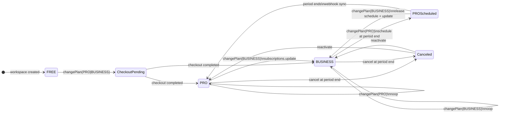
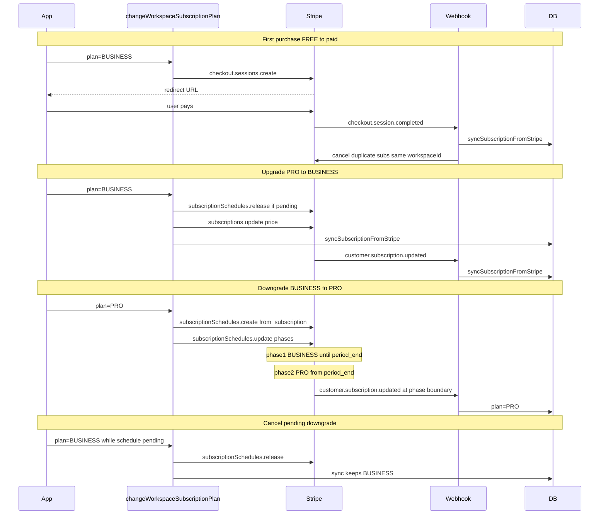

# Stripe billing architecture

P0 billing integrity: **one workspace = one active Stripe subscription**.

## Single entrypoint

All plan changes go through `changeWorkspaceSubscriptionPlan()` in [`src/features/billing/server/plan-change.ts`](../src/features/billing/server/plan-change.ts).

| Transition | Mechanism | Stripe API |
|------------|-----------|------------|
| FREE → PRO/BUSINESS | Checkout redirect | `checkout.sessions.create` |
| INCOMPLETE / no active Stripe sub | Checkout redirect | `checkout.sessions.create` |
| PRO → BUSINESS | Immediate upgrade | `subscriptions.update` (proration) |
| BUSINESS → PRO | End-of-period downgrade | `subscriptionSchedules.create` + `update` |
| Same plan as current | No-op | none |
| Scheduled downgrade + user picks current plan again | Cancel schedule | `subscriptionSchedules.release` |

UI and server actions call `changeWorkspacePlanAction` → `changeWorkspaceSubscriptionPlan`.

## Final state diagram



## Stripe lifecycle diagram



## Stripe Portal sync (cancel / reactivate)

When the owner uses **Manage billing** → Stripe Customer Portal, changes (cancel at period end, reactivate, payment method) fire `customer.subscription.updated` webhooks. On **localhost** without `stripe listen`, webhooks may not reach the app.

**Return flow (always):**

1. `openPortal` sets `return_url` → `/billing/portal-return`
2. [`portal-return/route.ts`](../src/app/[locale]/(dashboard)/dashboard/[workspaceSlug]/billing/portal-return/route.ts) calls `syncWorkspaceSubscriptionFromStripe(workspaceId)`
3. Redirect to `/billing`

`syncWorkspaceSubscriptionFromStripe` retrieves the subscription by **DB `stripeSubscriptionId`** (not “newest active”) — correct for cancel-at-period-end where status stays `active`.

Portal cancellation often sets Stripe `cancel_at` (timestamp) **without** `cancel_at_period_end: true`. Sync maps both to DB `cancelAtPeriodEnd`.

### Expected DB state after Portal cancel (not FREE immediately)

| Field | Value |
|-------|--------|
| `plan` | unchanged (e.g. BUSINESS) |
| `status` | ACTIVE |
| `cancelAtPeriodEnd` | **true** |
| `currentPeriodEnd` | end of paid period |
| effective status | ACTIVE until period end |

After period end: webhook `customer.subscription.deleted` → `expireWorkspaceSubscription` → EXPIRED (plan kept).

### Local dev without webhooks

```bash
# After portal changes, if DB is stale:
npm run dev:sync-workspace-billing -- --slug <slug>
```

Or rely on portal-return route when returning from Stripe Portal in the browser.

## Plan resolution

`resolvePlanFromStripeSubscription()` in [`stripe-plan-utils.ts`](../src/features/billing/server/stripe-plan-utils.ts):

1. `planHint` (checkout session metadata)
2. `subscription.metadata.plan`
3. `STRIPE_PRICE_*` env map
4. **Throws `BillingPlanResolutionError`** — no silent default to PRO

## Invariant enforcement

[`subscription-invariants.ts`](../src/features/billing/server/subscription-invariants.ts) — `enforceSingleActiveSubscription()`:

- Called after successful checkout sync and immediate upgrades
- Cancels other non-canceled Stripe subscriptions with the same `metadata.workspaceId`

## Migration checklist — duplicated subscriptions

Use when a workspace was upgraded via legacy Checkout (PRO→BUSINESS created a second sub).

### 1. Audit (read-only)

```bash
npm run dev:audit-duplicate-subscriptions
```

Review output per workspace:
- [ ] More than one active/trialing/past_due sub with same `workspaceId` metadata
- [ ] DB `stripeSubscriptionId` points to older sub
- [ ] DB `plan` does not match newest paid price

### 2. Dry-run cleanup (per workspace)

```bash
npm run dev:cleanup-duplicate-subscriptions -- --slug <slug> --dry-run
```

Confirm:
- [ ] **Keep** = newest subscription (highest `created`)
- [ ] **Cancel** = all other subs for that workspace

### 3. Execute cleanup

```bash
npm run dev:cleanup-duplicate-subscriptions -- --slug <slug>
```

Post-cleanup:
- [ ] `npm run dev:workspace-state -- --slug <slug>` shows correct `plan`
- [ ] Stripe Dashboard shows **one** active sub for workspace
- [ ] User billing page shows correct plan

### 4. Production

- [ ] Run audit against production Stripe (with production keys in secure env)
- [ ] Cleanup affected workspaces one-by-one (or scripted batch)
- [ ] Verify no double billing in Stripe invoices
- [ ] Deploy code with `changeWorkspaceSubscriptionPlan` before further upgrades

### 5. Regression tests

```bash
npm run test:workspace-billing
```

Manual:
- [ ] FREE → BUSINESS via Checkout
- [ ] PRO → BUSINESS via billing panel (no Checkout redirect)
- [ ] BUSINESS → PRO schedules downgrade at period end
- [ ] BUSINESS with pending PRO downgrade → click BUSINESS → schedule canceled
- [ ] Add storage pack on PRO; add storage + seats on BUSINESS
- [ ] BUSINESS → PRO downgrade drops seat items at period end, keeps storage

## Multi-item subscriptions (base plan + add-ons)

A paid subscription may contain multiple Stripe subscription items:

| Item type | Price env | Resolved by |
| --- | --- | --- |
| Base plan | `STRIPE_PRICE_PRO`, `STRIPE_PRICE_BUSINESS` | `findBasePlanSubscriptionItem()` |
| Storage add-on | `STRIPE_PRICE_ADDON_STORAGE` | `classifySubscriptionItems()` |
| Seat add-on | `STRIPE_PRICE_ADDON_SEATS` | `classifySubscriptionItems()` |

**Plan resolution** uses the base plan item only (`stripe-plan-utils.ts`), not `items[0]`.

**Sync path:** `syncSubscriptionFromStripe` → `syncWorkspaceAddonsFromStripe` → `syncWorkspaceEffectiveLimits` (base catalog limits + `WorkspaceAddon` rows → `Workspace` storage/seat caps).

**Add-on mutations:** `changeWorkspaceAddonQuantity()` (`addon-change.ts`) — creates/updates/deletes subscription items with proration. Guards: FREE blocked; seats BUSINESS-only; seat decrease blocked when over cap.

**Plan changes:**

- Upgrades (`PRO → BUSINESS`): `subscriptions.update` preserves existing add-on items.
- Downgrades (`BUSINESS → PRO`): subscription schedule phase 2 keeps storage items, **omits** seat items.

**DB model:** `WorkspaceAddon` (`addonKey`, `quantity`, `stripeSubscriptionItemId`, `status`). Cleared on subscription expire via `cancelAllWorkspaceAddons`.

## Related files

| File | Role |
|------|------|
| `plan-change.ts` | Single plan-change entrypoint |
| `addon-change.ts` | Add-on quantity changes on Stripe subscription |
| `addon-catalog.ts` | Unit sizes, prices, purchase guards, limit merge |
| `plan-pricing.ts` | Versioned plan price catalog (`PLAN_PRICES_PLN`), `resolvePlanPrice`, addon monthly cents |
| `parse-invoice-preview-lines.ts` | Split Stripe preview lines into recurring vs signed proration |
| `preview-billing-change.ts` | On-demand `createPreview` for plan/add-on change UX |
| `workspace-addon-sync.ts` | Stripe items ↔ `WorkspaceAddon` rows |
| `stripe-subscription-items.ts` | Classify base vs add-on items; schedule phase builder |
| `billing-service.ts` | Customer resolution, portal, re-exports |
| `subscription-sync.ts` | Webhook + checkout-success sync |
| `billing-actions.ts` | Server actions |
| `get-workspace-billing-page-data.ts` | RSC page data (usage, storage, next invoice) |
| `get-workspace-billing-addons-page-data.ts` | Add-ons page entitlements |
| `get-workspace-upcoming-invoice.ts` | Stripe `invoices.createPreview` for next invoice card |
| `checkout-success/route.ts` | Post-checkout sync via `session_id` |
| `portal-return/route.ts` | Post-portal sync via DB `stripeSubscriptionId` |
| `workspace-billing-panel.tsx` | Billing page UI shell |
| `workspace-addons-panel.tsx` | Add-ons stepper UI |
| `billing-plan-hero-banner.tsx` | Plan hero + artwork + primary actions |
| `billing-usage-stats-section.tsx` | Four usage stat cards |
| `billing-secondary-cards-section.tsx` | Add-ons summary + next invoice card |

Product / UX overview: [`docs/features/workspace-billing.md`](../features/workspace-billing.md).

## Price catalog alignment

UI prices come from the app catalog (`plan-pricing.ts`, `ADDON_UNIT_PRICES_PLN`). Stripe Prices are execution-only (checkout, `subscriptions.update`, `createPreview`).

Before production deploy:

```bash
CI_PRODUCTION=true npm run verify-stripe-prices
```

Locally / PR CI without the flag: mismatches log `WARNING` and exit `0`. With `CI_PRODUCTION=true`: exit `1`.

Checks: `PRO`, `BUSINESS`, `STORAGE_PACK`, `SEAT_PACK` — `unit_amount` **and** `currency === pln`.

Never remove a `planVersion` key from `PLAN_PRICES_PLN` while active subscriptions still pin that version.
