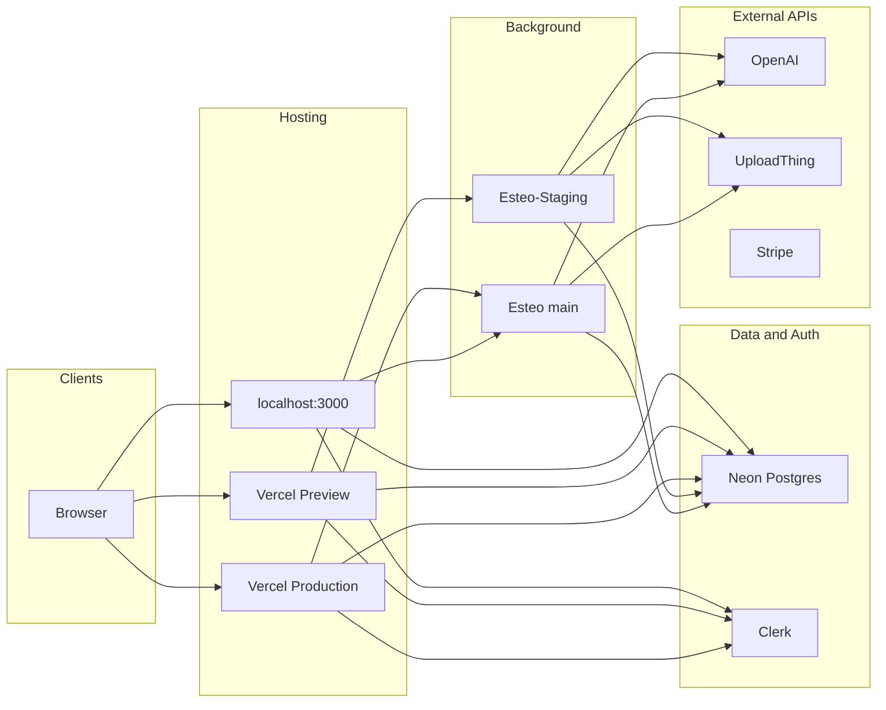
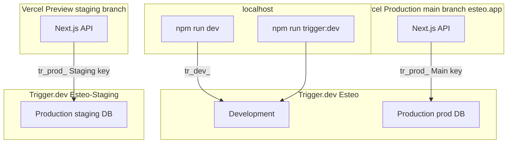

# Deployment and environments

Central reference for how Esteo runs across **localhost**, **Vercel Preview (staging)**, and **Vercel Production (main)** — domain architecture, which external services are involved, where environment variables live, and how Trigger.dev background jobs connect.

Related: [estimate-requests](../features/estimate-requests.md), [estimate-ai](estimate-ai.md), [database](database.md), [backend](backend.md), [authentication](../features/authentication.md), [database migrations](../dev/database-migrations.md). Incident: [Trigger.dev + Vercel Preview](../incidents/2026-06-08-trigger-dev-vercel-preview.md).

---

## Domain architecture

### Overview

Esteo uses a single primary application domain and a dedicated staging domain.

Production traffic is served from:

**https://esteo.app**

Staging / preview traffic is served from:

**https://preview.esteo.app**

This approach keeps URLs simple for customers while maintaining a fully isolated testing environment.

### Domain mapping

| Purpose | Environment | Domain |
| --- | --- | --- |
| Production application | Production | `https://esteo.app` |
| Preview / staging application | Preview | `https://preview.esteo.app` |
| Local development | Development | `http://localhost:3000` |
| Transactional email | Shared | `mail.esteo.app` |
| Sender addresses | Shared | `estimates@mail.esteo.app` |

### Application URLs

**Production** — canonical URL: `https://esteo.app`

Examples:

- `https://esteo.app`
- `https://esteo.app/pl/sign-in`
- `https://esteo.app/pl/sign-up`
- `https://esteo.app/pl/dashboard`
- `https://esteo.app/pl/dashboard/projects`
- `https://esteo.app/pl/dashboard/estimates`

Example deep link:

`https://esteo.app/pl/dashboard/ogrodzenia/estimates/t1unby250se3c77222h3jkx2`

**Preview** — canonical URL: `https://preview.esteo.app`

Examples:

- `https://preview.esteo.app`
- `https://preview.esteo.app/pl/sign-in`
- `https://preview.esteo.app/pl/dashboard`

Example deep link:

`https://preview.esteo.app/pl/dashboard/ogrodzenia/estimates/t1unby250se3c77222h3jkx2`

Preview is connected to the `staging` branch and is intended for QA, acceptance testing, and customer demonstrations before production releases.

### Vercel configuration

**Production**

| Setting | Value |
| --- | --- |
| Domain | `esteo.app` |
| Branch | `main` |
| `APP_URL` | `https://esteo.app` |
| `NEXT_PUBLIC_APP_URL` | `https://esteo.app` |

**Preview**

| Setting | Value |
| --- | --- |
| Domain | `preview.esteo.app` |
| Branch | `staging` |
| `APP_URL` | `https://preview.esteo.app` |
| `NEXT_PUBLIC_APP_URL` | `https://preview.esteo.app` |

Vercel maps branches automatically: pushes to `staging` create **Preview** deployments; pushes to `main` create **Production** deployments.

**Staging chain:** GitHub branch `staging` → Vercel **Preview** deployment → Trigger.dev project **Esteo-Staging** (Production bucket). Custom domain `preview.esteo.app` points at the same Preview deployment as the default `esteo-git-staging-*.vercel.app` URL.

### DNS provider

DNS is managed in **OVHcloud**.

| Domain | Record type | Target | Environment |
| --- | --- | --- | --- |
| `esteo.app` | A | Vercel | Production application |
| `preview.esteo.app` | CNAME | Vercel (`br8eaxzzss8333u.vercel-dns.com`) | Preview / staging |
| `mail.esteo.app` | TXT / CNAME / MX | Resend (DKIM, SPF, MX) | Transactional email |

### Email domain

Transactional emails are sent through Resend using a dedicated mail subdomain.

Verified domain: **`mail.esteo.app`**

Examples:

- `estimates@mail.esteo.app`
- `billing@mail.esteo.app`
- `support@mail.esteo.app`

Current sender: **`estimates@mail.esteo.app`**

Resend DNS records (DKIM, SPF, MX) are configured in OVHcloud. Set `EMAIL_FROM` in Vercel and Trigger.dev to match the active sender address.

### Authentication

Authentication is provided by [Clerk](../features/authentication.md).

| Environment | URL |
| --- | --- |
| Development | `http://localhost:3000` |
| Preview | `https://preview.esteo.app` |
| Production | `https://esteo.app` |

OAuth providers (Google, Apple) must allow all active application domains.

Allowed origins:

- `http://localhost:3000`
- `https://preview.esteo.app`
- `https://esteo.app`

### URL generation rules

Application URLs must **never** be hardcoded. Always use `process.env.APP_URL` or `process.env.NEXT_PUBLIC_APP_URL` when generating:

- email links
- magic links
- OAuth callbacks
- estimate links
- customer invitation links
- Stripe return URLs

Example:

```ts
const estimateUrl = `${process.env.APP_URL}/pl/estimate/${estimate.id}`;
```

### Future expansion

The current architecture intentionally leaves room for a dedicated marketing website.

Possible future setup:

| Domain | Purpose |
| --- | --- |
| `https://www.esteo.app` | Marketing site |
| `https://esteo.app` | Application |
| `https://preview.esteo.app` | Staging application |
| `https://mail.esteo.app` | Email infrastructure |

No application changes are required to support this future split.

---

## Three deployment models

| Model | Git branch | Vercel environment | Typical URL | Purpose |
| --- | --- | --- | --- | --- |
| **localhost** | any (local) | — | `http://localhost:3000` | Developer machine |
| **staging** | `staging` | **Preview** | **`https://preview.esteo.app`** (also `*.vercel.app`) | Pre-production, QA, acceptance testing |
| **main** | `main` | **Production** | **`https://esteo.app`** | Live production application |

### Staging domain setup (`preview.esteo.app`)

Configured **2026-06-18**:

1. **OVHcloud** — add CNAME `preview` → `br8eaxzzss8333u.vercel-dns.com` (propagation up to ~24 h).
2. **Vercel** — add `preview.esteo.app` to the Esteo project; assign to **Preview** (branch `staging`), not Production.
3. **GitHub** — push to `staging` triggers Preview deploy (unchanged).
4. **Trigger.dev** — **Esteo-Staging** project, Production env, GitHub branch `staging` (unchanged).

After DNS propagates, testers use `https://preview.esteo.app` instead of the auto-generated `*.vercel.app` hostname. Both URLs serve the same Preview deployment.

**Checklist when the custom domain is new:**

- Vercel → Domains: `preview.esteo.app` shows **Valid**.
- Clerk Dashboard: add `https://preview.esteo.app` to allowed origins / redirect URLs if sign-in fails on the custom host.
- Stripe test webhooks (if used on staging): endpoint URL must use the hostname you actually test on.



---

## Two layers of environment variables

Esteo uses **two separate runtime environments** for background work:

| Layer | What runs there | Where env vars are configured |
| --- | --- | --- |
| **Next.js (Vercel or localhost)** | API routes, Server Components, `tasks.trigger()` call | `.env` locally; Vercel → Environment Variables (Preview / Production) |
| **Trigger.dev worker** | `generate-estimate-draft`, `generate-attachment-thumbnails` | Trigger.dev dashboard → Environment Variables per project |

Setting `DATABASE_URL` on Vercel does **not** automatically give it to Trigger workers. Worker secrets must be set in the **Trigger.dev dashboard** for the matching project.

---

## External services matrix

| Service | Role in Esteo | localhost | Vercel Preview (staging) | Vercel Production (main) |
| --- | --- | --- | --- | --- |
| **Vercel** | Host Next.js app | — | Preview deploys from `staging` | Production deploys from `main` |
| **GitHub** (`chris38pl/esteo`) | Source repo | local clone | connected | connected |
| **Neon Postgres** | Prisma database | **development** branch | **staging** branch | **production** branch |
| **Clerk** | Authentication | test keys (shared with Preview) | same test keys | production keys |
| **OpenAI** | AI estimate draft | via Trigger dev worker (`.env`) | Trigger **Esteo-Staging** dashboard | Trigger **Esteo** dashboard |
| **UploadThing** | Attachment storage | `.env` + Trigger worker | Vercel + Trigger Staging dashboard | Vercel + Trigger main dashboard |
| **Trigger.dev** | Background jobs | main project **Development** | **Esteo-Staging** project **Production** | main **Esteo** project **Production** |
| **Stripe** | Billing, webhooks | test mode (optional) | test mode | live mode |
| **Resend** | Estimate send email (+ PDF) | sandbox in `.env` (see below) | `estimates@mail.esteo.app` on Vercel **and** Trigger Staging | `estimates@mail.esteo.app` on Vercel **and** Trigger main |
| **Cloudflare Turnstile** | Public form captcha (optional) | optional in `.env` | optional on Vercel Preview | optional on Vercel Production |

`DATABASE_URL` and `DIRECT_URL` must target the **same Neon branch** for a given environment. See [database.md](database.md).

### Email (`EMAIL_FROM`) — quick reference

Official outbound address: **`estimates@mail.esteo.app`** on the verified domain **`mail.esteo.app`** (Resend). Other reserved addresses: `billing@mail.esteo.app`, `support@mail.esteo.app`.

| Environment | `EMAIL_FROM` | Where to set |
| --- | --- | --- |
| **localhost** | Not used by default — code sends from `onboarding@resend.dev` (Resend sandbox). Set `EMAIL_DEV_REDIRECT_TO` to your inbox. Optional: `EMAIL_USE_PRODUCTION_FROM=true` to use `estimates@mail.esteo.app` locally. | `.env` |
| **staging** (Vercel Preview + Trigger **Esteo-Staging**) | `estimates@mail.esteo.app` | Vercel Preview env vars **and** Trigger.dev → Esteo-Staging → Environment Variables |
| **production** (Vercel Production + Trigger **Esteo**) | `estimates@mail.esteo.app` | Vercel Production env vars **and** Trigger.dev → Esteo → Environment Variables |

Also set `RESEND_API_KEY` and `EMAIL_FROM_NAME` (`Esteo`) in both Vercel and Trigger for each environment. The send job runs on the **Trigger worker**, not on Vercel — missing keys there cause send failures even when the UI enqueue succeeds.

Full behaviour (sandbox, redirect, reply-to): [`estimate-send-workflow.md`](../features/estimate-send-workflow.md#email-from-address).

---

## Trigger.dev — two projects

On the Trigger.dev free tier, **Staging** and **Preview** cloud environments are not available. We use **two separate Trigger.dev projects** instead of mixing staging data into one Production bucket.

| Trigger.dev project | Trigger environment | Used by | Worker env vars (examples) |
| --- | --- | --- | --- |
| **Esteo** (main) | **Development** | localhost + `npm run trigger:dev` | N/A — worker reads local `.env` |
| **Esteo** (main) | **Production** | Vercel Production (`main` branch) | prod `DATABASE_URL`, prod OpenAI, prod UploadThing |
| **Esteo-Staging** | **Production** | Vercel Preview (`staging` branch) | staging `DATABASE_URL`, staging OpenAI, staging UploadThing |

The name **Production** inside Trigger.dev is only a deployment bucket — Esteo-Staging Production intentionally points at **staging** infrastructure.



### Configuration files and scripts

- [`trigger.config.ts`](../../trigger.config.ts) — `project: process.env.TRIGGER_PROJECT_ID ?? "proj_..."`
- [`package.json`](../../package.json):
  - `npm run dev` — Next.js local server
  - `npm run trigger:dev` — local Trigger worker (Development, main Esteo project)
  - `npm run trigger:deploy` — deploy tasks to cloud (`npx trigger.dev@4.4.6 deploy`)
  - `npm run build` — `next build` (local)
  - `npm run build:vercel` — Preview migrate deploy + `next build` (Vercel via [`vercel.json`](../../vercel.json))
  - `npm run prisma:migrate:staging` — manual `migrate deploy` to Neon staging (local `.env` `_STAGING` vars)
  - `postinstall` — `prisma generate`

### GitHub integration

| Trigger project | Production branch mapping |
| --- | --- |
| **Esteo-Staging** | `staging` |
| **Esteo** (main) | `main` |

Pushing to `staging` auto-deploys tasks to Esteo-Staging Production when GitHub integration is connected.

### Manual task deploy (Esteo-Staging)

```powershell
$env:TRIGGER_PROJECT_ID="proj_<staging_ref>"
npm run trigger:deploy
```

Or: `npm run trigger:deploy:staging` (uses `--native-build-server` — required on Windows; local Depot build often fails with `spawn UNKNOWN`).

```powershell
npx trigger.dev@4.4.6 deploy --project-ref proj_lkorkbyjorynapnptmqa --native-build-server
```

Project ref is shown in the Trigger.dev dashboard (e.g. check **Esteo-Staging → Settings**).

**Lockfile:** Trigger’s remote `npm ci` fails if `package.json` and `package-lock.json` are out of sync (e.g. missing `@swc/helpers`). Run `npm install` locally and commit the lockfile before deploy.

### Vercel integration (optional)

Trigger.dev Vercel integration can sync env vars and trigger deploys. **Not required** when GitHub integration on Esteo-Staging is active. Avoid connecting both main Esteo and Esteo-Staging to the same Vercel project without a clear mapping — use one Trigger project per Vercel deployment target.

### What not to do

- `npx trigger.dev build` — **does not exist** (valid command is `deploy`)
- `tr_prod_` from **main Esteo** + staging Neon in **one** Trigger Production — conflicts at launch
- `tr_dev_` on Vercel Preview without a local `trigger:dev` worker — tasks will not run for external testers

---

## Environment variables per model

### a) localhost

**Config file:** `.env` (or `.env.local`) in repo root — never commit secrets.

| Variable | Value source | Required |
| --- | --- | --- |
| `DATABASE_URL` | Neon **development** branch (pooler) | Yes |
| `DIRECT_URL` | Neon **development** branch (direct) | Yes for migrations |
| `DATABASE_URL_STAGING`, `DIRECT_URL_STAGING` | Neon **staging** branch | Optional — for `npm run prisma:migrate:staging` only |
| `NEXT_PUBLIC_CLERK_*`, `CLERK_SECRET_KEY` | Clerk test app | Yes |
| `OPENAI_API_KEY` | OpenAI | Yes (worker uses via `.env` in dev) |
| `UPLOADTHING_TOKEN` | UploadThing | Yes if testing attachments |
| `TRIGGER_PROJECT_ID` | **Main Esteo** project ref | Yes |
| `TRIGGER_SECRET_KEY` | **Main Esteo → Development** (`tr_dev_...`) | Yes |
| `STRIPE_SECRET_KEY`, `STRIPE_WEBHOOK_SECRET` | Stripe test | If testing billing |
| `STRIPE_PRICE_PRO`, `STRIPE_PRICE_BUSINESS` | Stripe dashboard | If testing billing |
| `ESTIMATE_REQUEST_TURNSTILE_SECRET_KEY` | Cloudflare | Optional |
| `APP_URL`, `NEXT_PUBLIC_APP_URL` | `http://localhost:3000` | Yes |

**Run locally (two terminals):**

```bash
npm run dev
npm run trigger:dev
```

Without `trigger:dev`, tasks queue in Development and expire (no cloud worker on free tier for dev without local process).

**Known warning:** `send-estimate-to-customer.ts` may log **Slow import timing detected (>1s)** on worker start — expected, not a failure. See [diagnostics](../diagnostics/trigger-slow-import-send-estimate-to-customer.md).

**Isolated from Preview:** localhost uses Neon **development**; Vercel Preview uses Neon **staging**. See [database migrations](../dev/database-migrations.md).

---

### b) staging — Vercel Preview

**Git:** branch `staging` → Vercel **Preview** deployment.

**Vercel → Project → Environment Variables** — ensure **Preview** checkbox is enabled for each variable.

| Variable | Value source | Preview checkbox |
| --- | --- | --- |
| `APP_URL`, `NEXT_PUBLIC_APP_URL` | `https://preview.esteo.app` | Preview |
| `DATABASE_URL`, `DIRECT_URL` | Neon **staging** branch | Preview |
| Clerk keys | Same test app as localhost | Preview |
| `UPLOADTHING_TOKEN` | UploadThing | Preview |
| `TRIGGER_PROJECT_ID` | **Esteo-Staging** project ref | **Preview** |
| `TRIGGER_SECRET_KEY` | **Esteo-Staging → Production** API key (`tr_prod_...`) | **Preview** |
| `OPENAI_API_KEY` | Optional on Vercel (submit API does not call OpenAI directly) | Preview |
| Stripe test keys | If testing billing on Preview | Preview |

**Trigger.dev → Esteo-Staging → Production → Environment Variables:**

| Variable | Value |
| --- | --- |
| `DATABASE_URL` | Same staging Neon as Vercel Preview |
| `OPENAI_API_KEY` | Staging/dev key |
| `UPLOADTHING_TOKEN` | Same as Vercel |

**Build on Vercel:** `npm run build:vercel` → `prisma migrate deploy` (Preview only) → `next build`. Prisma client via `postinstall`. Task deploy via GitHub integration or manual `trigger:deploy`.

**Preview migrations:** automatic on every Preview deploy when `DATABASE_URL` and `DIRECT_URL` point at Neon staging. Details: [database migrations](../dev/database-migrations.md).

**After changing env vars:** redeploy Preview (env changes do not always apply to running instances).

---

### c) main — Vercel Production

**Git:** branch `main` → Vercel **Production** deployment at **`https://esteo.app`**.

**Vercel → Project → Environment Variables** — ensure **Production** checkbox is enabled for each variable.

| Variable | Value source | Production checkbox |
| --- | --- | --- |
| `APP_URL`, `NEXT_PUBLIC_APP_URL` | `https://esteo.app` | Production |
| `DATABASE_URL`, `DIRECT_URL` | Neon **production** branch | Production |
| Clerk keys | Production Clerk application | Production |
| `UPLOADTHING_TOKEN` | UploadThing | Production |
| `TRIGGER_PROJECT_ID` | **Esteo** (main) project ref | Production |
| `TRIGGER_SECRET_KEY` | **Esteo → Production** API key (`tr_prod_...`) | Production |
| Stripe live keys | Stripe dashboard | Production |
| `EMAIL_FROM` | `estimates@mail.esteo.app` | Production |

**Trigger.dev → Esteo → Production → Environment Variables:**

| Variable | Value |
| --- | --- |
| `DATABASE_URL` | Same production Neon as Vercel Production |
| `OPENAI_API_KEY` | Production key |
| `UPLOADTHING_TOKEN` | Same as Vercel |
| `RESEND_API_KEY`, `EMAIL_FROM` | Production email sending |

**Build on Vercel:** `npm run build:vercel` on Production uses `next build` (migrations run on Preview only via `build:vercel`). Task deploy via GitHub integration on push to `main`.

**Esteo-Staging** remains unchanged — continues to serve Preview only (`preview.esteo.app`).

---

## Public estimate request flow (reference)

End-to-end path when Preview is configured correctly:

1. User submits public form → `POST /api/public/estimate-requests` ([`route.ts`](../../src/app/api/public/estimate-requests/route.ts))
2. **Vercel env:** validation, optional Turnstile, rate limit
3. **Vercel env:** UploadThing upload (if attachments)
4. **Vercel env:** Prisma writes (`DATABASE_URL`)
5. **Vercel env:** `tasks.trigger('generate-estimate-draft')` using `TRIGGER_SECRET_KEY` → **Esteo-Staging Production**
6. **Trigger dashboard env:** worker runs task — Prisma, OpenAI, attachment promotion
7. User sees estimate with AI-generated sections

If step 5 fails → HTTP 500, user message „Nie udało się wysłać zgłoszenia…”. If step 6 fails → submit may succeed but request stays `PROCESSING` / `FAILED` — check **Esteo-Staging → Runs**.

---

## Deploy and CI summary

| Action | Trigger |
| --- | --- |
| Vercel Preview deploy | `git push` to `staging` |
| Vercel Production deploy | `git push` to `main` |
| Trigger Staging task deploy | GitHub integration on push to `staging`, or manual `trigger:deploy` |
| Trigger main task deploy | GitHub integration on push to `main` |
| Prisma migrations (local dev) | `npm run prisma:migrate` against Neon **development** `DIRECT_URL` |
| Prisma migrations (staging, manual) | `npm run prisma:migrate:staging` |
| Prisma migrations (Preview deploy) | automatic via `build:vercel` on Vercel Preview |
| Prisma generate (Vercel) | automatic via `postinstall` |

---

## Operational checklists

### New developer (localhost)

1. Clone `chris38pl/esteo`
2. Copy `.env.example` → `.env`, fill secrets (Neon **development** branch, Clerk test, etc.)
3. `TRIGGER_PROJECT_ID` + `TRIGGER_SECRET_KEY` = **main Esteo Development** (`tr_dev_...`)
4. `npm install`
5. `npm run prisma:migrate` (if schema changed)
6. Terminal 1: `npm run dev`
7. Terminal 2: `npm run trigger:dev`
8. Open `http://localhost:3000`

### Preview deploy / env change

1. Update variables in Vercel with **Preview** scope where needed
2. Confirm `TRIGGER_SECRET_KEY` and `TRIGGER_PROJECT_ID` both have Preview enabled
3. Confirm Trigger **Esteo-Staging → Production** dashboard has worker env vars
4. Redeploy latest Preview deployment
5. Test on **`https://preview.esteo.app`** (or latest `*.vercel.app` Preview URL): submit estimate request (with and without attachments)
6. Verify run in **Esteo-Staging → Production → Runs**

### Production deploy / env change

1. Update variables in Vercel with **Production** scope where needed
2. Confirm `APP_URL` and `NEXT_PUBLIC_APP_URL` are `https://esteo.app`
3. Confirm `TRIGGER_SECRET_KEY` and `TRIGGER_PROJECT_ID` both have Production enabled (main **Esteo** project)
4. Confirm Trigger **Esteo → Production** dashboard has worker env vars
5. Redeploy latest Production deployment
6. Smoke test on **`https://esteo.app`**: sign-in, dashboard, estimate send
7. Verify Stripe webhook URL points to `https://esteo.app/api/...`

### Production launch checklist (initial or major cutover)

1. DNS: `esteo.app` A record points to Vercel
2. Vercel → Domains: `esteo.app` shows **Valid**, assigned to **Production** (`main`)
3. Set `APP_URL` / `NEXT_PUBLIC_APP_URL` to `https://esteo.app` on Vercel Production
4. Create prod Neon branch; set Vercel Production `DATABASE_URL` / `DIRECT_URL`
5. Clerk production instance; add `https://esteo.app` to allowed origins; update Vercel Production Clerk keys
6. Stripe live mode; webhook URL on `https://esteo.app`
7. `CI_PRODUCTION=true npm run verify-stripe-prices` (catalog vs Stripe `unit_amount` + `pln`)
8. Trigger **main Esteo → Production** env vars (prod secrets)
9. Deploy tasks: GitHub integration Production → `main`
10. Vercel Production: `TRIGGER_*` from main Esteo Production
11. Smoke test on `https://esteo.app`; keep Esteo-Staging for Preview unchanged

### Debug public submit 500

1. Vercel Logs → filter `POST /api/public/estimate-requests`
2. Find line `[public estimate-requests]` with actual error
3. Common causes:
   - `ApiClientMissingError` — `TRIGGER_SECRET_KEY` missing on **Preview** (not only Production)
   - `TRIGGER_PROJECT_ID` / `TRIGGER_SECRET_KEY` from different Trigger projects
   - `UPLOADTHING_TOKEN` missing when uploading files
   - `DATABASE_URL` wrong or unreachable
4. Effect version warnings and UploadThing deprecation logs are **noise**, not root cause

---

## Related documentation

- [Trigger.dev deployment overview](https://trigger.dev/docs/deployment/overview)
- [Trigger.dev Vercel integration](https://trigger.dev/docs/vercel-integration)
- [Incident: Trigger.dev + Vercel Preview](../incidents/2026-06-08-trigger-dev-vercel-preview.md)
