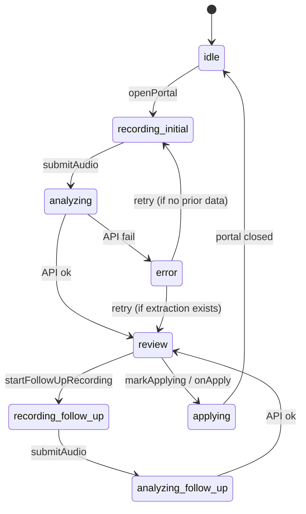

# Voice intake — architecture

Technical reference for `src/features/voice-intake/` and related AI/server code.

## Folder layout

```txt
src/features/voice-intake/
├── components/          # Portal UI stages + controller
├── hooks/
│   ├── use-voice-intake.ts      # Session state, API submit, phases
│   ├── use-voice-form-apply.ts  # Animated form fill
│   └── use-media-recorder.ts    # MediaRecorder + level meter
├── lib/                 # Pure helpers (mapping, missing fields, analytics)
├── server/              # analyze-voice-intake, security, validate-audio
├── fixtures/            # Admin preview mock data
└── types.ts

src/ai/
├── schemas/voice-intake-extraction.ts
├── prompts/voice-intake-*.ts
├── services/
│   ├── transcribe-audio.ts
│   ├── extract-voice-intake.ts
│   └── stabilize-voice-intake-merge.ts
└── lib/clean-voice-transcript.ts

src/app/api/
├── public/voice-intake/route.ts
└── estimate-requests/voice-intake/route.ts
```

## Component graph

```txt
VoiceIntakeController
├── useVoiceIntake
├── useVoiceFormApply
├── renderTrigger (footer bar | trigger button)
└── VoiceExperiencePortal
    ├── VoiceRecordingStage → VoiceInitialRecordingStage | VoiceFollowUpRecordingStage
    ├── VoiceAnalyzingStage
    ├── VoiceSummaryStage
    └── VoiceErrorStage
```

`VoiceIntakeController.handleApply`:

1. `mapExtractionToForm`
2. `applyMappedState` (animated)
3. `onMetadataReady` / `onAppliedValuesReady`

## State machine (client)

Managed in `use-voice-intake.ts`:



`applyPhase` (`idle` | `checklist_reveal` | `filling` | `done`) is set during apply but checklist reveal is not a separate UI screen yet — reserved for future checklist animation.

## API

### `POST /api/public/voice-intake?locale=pl|en`

`multipart/form-data`:

| Field | Description |
| --- | --- |
| `audio` | Recording file |
| `workspaceSlug` | Target workspace |
| `durationMs` | Client-reported duration |
| `fieldDefinitions` | JSON — workspace industry fields for prompt |
| `industry` | Optional override; defaults from workspace record |
| `industryOtherText` | Optional Business Type for Services workspaces |
| `captchaToken` | Turnstile / captcha |
| `followUpContext` | JSON — previous extraction + missing keys (follow-up only) |

### `POST /api/estimate-requests/voice-intake`

Same shape; authenticated workspace member. Rate limit per `userId`. No captcha.

### Response (`VoiceIntakeApiResponse`)

- `transcript`, `followUpTranscript?`, `combinedTranscript`, `cleanedTranscript`
- `displayTitle`
- `extraction` (`VoiceIntakeExtraction`)
- `overallConfidence`

Errors: JSON `{ error: VoiceIntakeErrorCode }` with 4xx/5xx.

## Server pipeline (`analyzeVoiceIntake`)

```txt
validateVoiceAudio (size, duration, mime)
↓
transcribeAudio (Whisper)
↓
cleanVoiceTranscript
↓
extractVoiceIntake | extractVoiceIntakeFollowUp
  (primary model; fallback on failure)
↓
buildTitleFromExtraction, computeOverallConfidence
↓
return VoiceIntakeApiResponse
```

Follow-up path passes `FollowUpContext`: previous transcript, extraction, missing field keys/labels. Merge stabilization in `stabilize-voice-intake-merge.ts`.

## Industry segments

Missing fields, extraction prompts, and form mapping are driven by `getIndustryExperienceConfig(industry)` (`src/features/estimate-requests/config/industry-experience-config.ts`). Use `isServiceWorkspace()` — not raw `industry === OTHER`.

| Segment | Enum today | Voice collects | Skips |
| --- | --- | --- | --- |
| Construction | `CONSTRUCTION` (+ future trade enums) | property type, city, area, scope, timeline, contact | — |
| Services | `OTHER` | service description, service location, scope, timeline, contact | property type, area |

Services prompts include a **Business Type** block (`industryOtherText`) instead of a construction `## Role`. i18n: `voiceIntake.byIndustry.{construction|services}`.

## Extraction schema

[`voice-intake-extraction.ts`](../../src/ai/schemas/voice-intake-extraction.ts) — Zod object with `{ value, confidence }` per field, plus:

- `projectSummary` (value + bullets)
- `scopeOfWork.items[]`
- `ambiguities[]` (field + candidates)
- `generatedTitle`, `description`, contact, address, industry fields

Prompts: `voice-intake-extraction.ts`, `voice-intake-follow-up.ts`, shared rules in `voice-intake-shared-rules.ts`. Field definitions from workspace industry config via `buildFieldDefinitionsForVoice`.

## Form field binding

Estimate form wrappers expose `data-voice-field="{path}"` for highlight + scroll during apply. Paths defined in [`apply-field-sequence.ts`](../../src/features/voice-intake/lib/apply-field-sequence.ts) and [`voice-form-apply-sequence.ts`](../../src/features/voice-intake/lib/voice-form-apply-sequence.ts).

Apply order (visual top → bottom):

`title` → contact → `area_size` → address → `property_type` → `preferredStartDate` → `description`

## Analyzing UI timing

[`voice-analyzing-stage.tsx`](../../src/features/voice-intake/components/voice-analyzing-stage.tsx) — **client-only** progress; not tied to real API substeps.

| Flow | Step durations before last | Last step |
| --- | --- | --- |
| Initial (4 steps) | 2.6s + 2.4s + 2.2s | Holds until unmount |
| Follow-up (2 steps) | 1.8s | Holds until unmount |

Rationale: API wait is usually 10–70s; user should spend ~90% of wait time on the final step. See [decisions doc](../features/voice-intake-decisions.md).

## Typewriter apply

[`typewriter-field-value.ts`](../../src/features/voice-intake/lib/typewriter-field-value.ts):

- Default: per-character with jitter.
- `project.description` when length > 50: chunked reveal, `DESCRIPTION_MAX_MS = 3500`, step ~42ms.

## Analytics

[`voice-analytics.ts`](../../src/features/voice-intake/lib/voice-analytics.ts) — client events e.g. `voice_started`, `voice_apply`, `voice_apply_checklist_reveal`, follow-up applied.

## Security

[`server/security.ts`](../../src/features/voice-intake/server/security.ts) — in-memory sliding window rate limits.

Public route: workspace must exist, captcha, fingerprint IP.

## Admin preview

[`admin-voice-intake-preview-panel.tsx`](../../src/features/voice-intake/components/admin-voice-intake-preview-panel.tsx):

- Screen picker (recording, analyzing, summary, error, trigger).
- Toggles: mobile viewport, follow-up resolved items, mock missing fields.
- `fitMobileContent`: shell grows with content instead of fixed height + inner scroll on narrow viewport.

## Environment

- `OPENAI_API_KEY` — transcription + extraction
- Public captcha env — same as estimate request form

## Testing locally

1. `npm run dev` — use Chrome on localhost (Cursor browser sandbox cannot reach localhost).
2. Test account: `.env.test.local` (`TEST_USER_EMAIL` / `TEST_USER_PASSWORD`).
3. Admin gallery: `/pl/dashboard/admin/voice-intake-preview`.
4. Public: `/pl/wycena/{workspaceSlug}` → footer voice bar.

**Dev stability:** long sessions with webpack dev may OOM (~6.5 GB). Restart with:

```powershell
$env:NODE_OPTIONS="--max-old-space-size=8192"; npm run dev
```

Clear `.next` if webpack cache corruption warnings appear.

## Benchmark

`scripts/voice-intake-benchmark/` — runs extraction against JSON fixtures, scores field accuracy. Used to tune prompts; not CI-gated initially.
