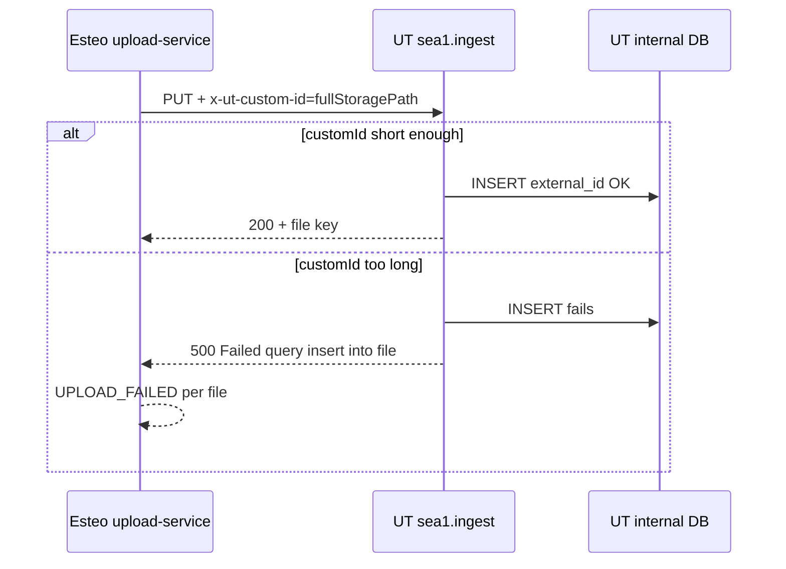

# Diagnostyka: częściowy sukces uploadów UploadThing (public form, 7 plików)

**Data:** 2026-06-07  
**Status:** Rozwiązane (fix wdrożony i zweryfikowany)  
**Powiązany incydent:** [../incidents/2026-06-07-uploadthing-customid-batch-upload-partial-failure.md](../incidents/2026-06-07-uploadthing-customid-batch-upload-partial-failure.md)

## Kontekst

Publiczny formularz estimate request pozwala załączyć do **10 plików** (limit requestu: 10 plików / 10 MB). Użytkownik przesłał **7 obrazów PNG** (w tym pliki ChatGPT z długimi nazwami). W bazie i UI zapisał się **tylko 1 załącznik** - pozostałe 6 zwróciło błąd uploadu.

Pipeline (Phase 2):

```txt
POST /api/public/estimate-requests
→ submitEstimateRequestWithAttachments
→ uploadFilesForEstimateRequest (sekwencyjna pętla for, bez Promise.all)
→ per file: uploadBlobToStorage → UTApi.uploadFiles
→ incrementWorkspaceStorageUsed (per file, poza transakcją)
→ estimateRequest.create z JSON attachments
→ tasks.trigger generate-estimate-draft → promotion → thumbnail job
```

Kluczowe pliki:

| Rola | Ścieżka |
| --- | --- |
| Pętla uploadu requestów | `src/features/attachments/server/upload-service.ts` |
| Provider UploadThing | `src/features/attachments/server/storage/uploadthing-provider.ts` |
| Diagnostyka (dev-only) | `src/features/attachments/server/storage/uploadthing-diagnostic.ts` |
| Submit orchestrator | `src/features/estimate-requests/server/submit-estimate-request-with-attachments.ts` |

## Objawy

| Metryka | Wartość |
| --- | --- |
| Pliki w batchu | 7 |
| Zapisane (`stored`) | 1 |
| Nieudane (`failed`) | 6 |
| HTTP response API | 200 (partial success - ≥1 plik stored) |
| Komunikat SDK | `[UPLOAD_FAILED] Failed to upload file` |

## Hipotezy wykluczone (fałszywe tropy)

### 1. Prisma / Neon jako źródło błędu `insert into file`

Komunikat `Failed query: insert into file (...)` pochodzi z **wewnętrznej bazy UploadThing** (kolumna `external_id`), nie z naszego schematu Prisma. Nasza aplikacja nie ma modelu `file` ani webhooków UploadThing zapisujących metadane po uploadzie.

### 2. Duplikat `customId` w batchu

Każdy plik miał unikalny UUID w ścieżce storage. Logi potwierdziły różne `customId` per plik.

### 3. Rate limiting UploadThing

Przy każdym failu nagłówki: `ratelimit-limit: 20`, `ratelimit-remaining: 19`. Uploady były **sekwencyjne** (nie równoległe).

### 4. `Promise.all` / równoległy upload

Kod używa `for` z `await` - jeden plik na raz.

### 5. Miniaturki synchroniczne przy submit

Po refaktorze async thumbnails submit wysyła **tylko oryginały** (1× UT per file). Błąd występował już na pierwszym PUT oryginału, przed Trigger.dev.

### 6. Losowość / flaki sieci

Wzorzec **deterministyczny**: plik #1 zawsze OK, pliki #2–#7 zawsze fail - ten sam zestaw nazw plików.

## Batch referencyjny (przed fixem)

**Request ID:** `htaaolihfnzwbca21pxuzpe7`  
**Timestamp:** 2026-06-07T17:24:55–17:25:01Z

| # | Nazwa pliku | Wynik | Długość `customId` (= pełna ścieżka storage) |
| --- | --- | --- | --- |
| 1 | `plan taras.png` | **SUCCESS** | ~118 znaków |
| 2 | `ChatGPT Image 7 cze 2026, 14_30_15.png` | **FAIL** | ~144 znaki |
| 3 | `ChatGPT Image 7 cze 2026, 13_42_49.png` | **FAIL** | ~144 znaki |
| 4 | `4faed427-c66a-4900-b8db-583f7cea007b.png` | **FAIL** | ~146 znaków |
| 5 | `ChatGPT Image 7 cze 2026, 10_16_40.png` | **FAIL** | ~144 znaki |
| 6 | `ChatGPT Image 7 cze 2026, 10_09_54.png` | **FAIL** | ~144 znaki |
| 7 | `ChatGPT Image 7 cze 2026, 10_03_58.png` | **FAIL** | ~144 znaki |

**Batch complete:** `storedCount: 1`, `failedCount: 6`

### Przykładowy błąd HTTP (plik #2)

```txt
PUT https://sea1.ingest.uploadthing.com/...
statusCode: 500 Internal Server Error

responseBody.message:
Failed query: insert into `file` (..., `external_id`, ...)
params: ...,
  cmq13xm15000kufvgyye9ucgl/requests/htaaolihfnzwbca21pxuzpe7/
  0544ca23-5053-4285-a9b2-444065e2ed82/
  original-ChatGPT_Image_7_cze_2026__14_30_15.png,
  ...
```

SDK mapuje to na:

```txt
error.code: UPLOAD_FAILED
error.message: Failed to upload file
```

### Mechanizm przed fixem

W `uploadthing-provider.ts` (stan sprzed 2026-06-07):

```typescript
const customId = params.key; // pełna ścieżka logiczna
const file = new UTFile([...], fileName, { customId });
await utapi.uploadFiles([file]);
```

Ścieżka logiczna (`buildRequestStorageKey`):

```txt
{workspaceId}/requests/{requestId}/{fileId}/original-{sanitizedFileName}
```

Ta wartość trafiała do UT jako `customId` → w ingest jako `x-ut-custom-id` → w DB UT jako `external_id`.

Po sukcesie aplikacja **nadpisywała** `storageKey` w metadata kluczem UT (`YO4vGzP4JADj...`) - to poprawne dla `delete` / `download` / signed URL.

## Diagnostyka - jak zbieraliśmy dowody

### Problem: obcięte logi w terminalu

Długie JSON-y z `uploadFiles` i body HTTP 500 ucinały się w buforze PowerShell.

### Rozwiązanie tymczasowe: JSONL + fetch wrapper

Moduł `uploadthing-diagnostic.ts`:

- Logi per zdarzenie (upload start/success/failure, HTTP request/response)
- Zapis do `{tmpdir}/esteo-ut-upload-debug.jsonl` (**tylko `NODE_ENV=development`**)
- `createUploadThingDiagnosticFetch()` - pełne body odpowiedzi ingest
- Pola: `customId`, `customIdLength`, `logicalKey`, `logicalKeyLength`
- Jeden plik **nadpisywany** na start batcha (nie append w nieskończoność)
- Vercel staging/production: **wyłączone** (`NODE_ENV !== "development"`)
- Lokalne wyłączenie: `UPLOADTHING_UPLOAD_DEBUG=0` w `.env.local`

### Odpowiedzi na pytania kontrolne

| Pytanie | Odpowiedź |
| --- | --- |
| Czy wszystkie `customId` unikalne? | Tak |
| Czy ten sam błąd? | Tak - HTTP 500 + failed INSERT w DB UT |
| Czy fail zawsze od pliku #2? | Tak - deterministycznie |
| Czy rate limit? | Nie - remaining 19/20 |

## Root cause (potwierdzony)

**Zbyt długi `customId` wysyłany do UploadThing** (pełna ścieżka storage jako `external_id`).

Korelacja:

- Najkrótsza ścieżka (plik #1, krótka nazwa) → **przechodzi**
- Dłuższe ścieżki (długie nazwy ChatGPT w segmencie `original-...`) → **INSERT fail** po stronie UT

Oficjalny limit długości `customId` w dokumentacji UT nie był dostępny w trakcie diagnozy; fix oparty na korelacji empirycznej i udanym re-testcie.



## Fix (2026-06-07)

### Strategia: UUID-only dla UT `customId`

Oddzielono identyfikator UT od ścieżki logicznej:

| Pole | Wartość | Cel |
| --- | --- | --- |
| `customId` (→ UT) | `item.id` (UUID, 36 znaków) | `external_id` w UploadThing |
| `key` (logiczny) | `buildRequestStorageKey(...)` | Tylko logi / diagnostyka |
| `storageKey` w DB | `first.data.key` (klucz UT) | delete, download, signed URL |

Zmiany:

- `src/features/attachments/server/storage/types.ts` - `upload({ key, customId, ... })`
- `uploadthing-provider.ts` - `UTFile` z `params.customId`
- `upload-service.ts` - `customId: item.id` w `uploadBlobToStorage`
- `thumbnail-generation-service.ts` - `customId: \`${attachment.id}-thumb\`` (~42 znaki)

Brak migracji Prisma.

## Batch weryfikacyjny (po fixie)

**Request ID:** `xz46wa7vd3u9g4ajmjw97thm`  
**Timestamp:** 2026-06-07T17:33:42–17:33:50Z

| # | Plik | Wynik | `customIdLength` | `logicalKeyLength` |
| --- | --- | --- | --- | --- |
| 1–7 | Ten sam zestaw co przed fixem | **SUCCESS** | 36 | 120–146 |

**Batch complete:** `storedCount: 7`, `failedCount: 0`

Przykład pliku #2 (wcześniej zawsze fail):

```txt
customId: 0d8d9e50-53fb-4fd0-8ae5-916620956a56
customIdLength: 36
logicalKeyLength: 144
HTTP: 200 OK
x-ut-custom-id=0d8d9e50-53fb-4fd0-8ae5-916620956a56
```

Miniatury (Trigger.dev) po promocji: `customIdLength: 42` (`{attachmentId}-thumb`), wszystkie HTTP 200.

## Odłożone refaktory (poza scope fixu)

Świadomie **nie** wdrożono w ramach tego incydentu:

| Temat | Opis |
| --- | --- |
| Batch quota w transakcji | `incrementWorkspaceStorageUsed` per file w pętli |
| Split UT vs Prisma errors | Osobne try/catch + kompensacja orphan blobów |
| Retry ConnectionReset | Neon po długim I/O |
| Dedupe `prepareFileBuffers` | Precheck + upload reuse |
| Usunięcie diagnostyki | Zostaje dev-only do dalszego QA |

## Wzorce na przyszłość

1. **Nigdy nie używaj długiej ścieżki storage jako UploadThing `customId`.** Używaj krótkiego stabilnego ID (UUID rekordu pliku).
2. **Komunikat `insert into file` ≠ Prisma.** Szukaj w odpowiedzi HTTP ingest UploadThing.
3. **Partial success w public form jest zamierzony** - loguj `storedCount` / `failedCount` i pokazuj `attachmentWarnings` w UI.
4. **Przy debugowaniu UT** używaj `getUploadDiagnosticLogPath()` / pliku w katalogu temp OS lokalnie; na Vercel diagnostyka jest wyłączona.
5. **Po sukcesie UT** w DB trzymamy **klucz UT** (`YO4vGzP4JADj...`), nie logiczną ścieżkę - to poprawne dla operacji storage.

## Powiązana dokumentacja

- [Estimate attachments (feature)](../features/estimate-attachments.md)
- [Incydent - skrót i fix](../incidents/2026-06-07-uploadthing-customid-batch-upload-partial-failure.md)
