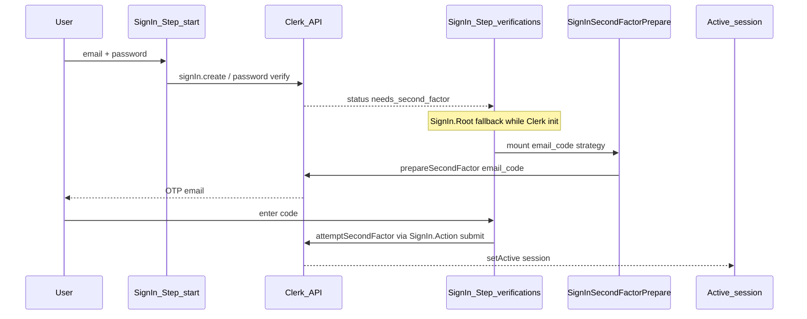

# Authentication (Clerk Elements)

Custom sign-in UI built with [Clerk Elements](https://clerk.com/docs/guides/customizing-clerk/elements/overview) on `@clerk/nextjs`. Sign-up uses a parallel pattern (`sign-up-form.tsx`, `sign-up-continue.tsx`).

**Incident postmortem:** [2026-06-06 sign-in /continue](../incidents/2026-06-06-sign-in-continue-blank.md)

## Stack

| Item | Value |
| --- | --- |
| Packages | `@clerk/nextjs@6.39.5`, `@clerk/elements@0.24.13` (pinned — do not upgrade without re-verifying email second-factor prepare) |
| Routing | Path-based: `SignIn.Root routing="path" path="/[locale]/sign-in"` |
| Page | [`src/app/[locale]/(auth)/sign-in/[[...sign-in]]/page.tsx`](../../src/app/[locale]/(auth)/sign-in/[[...sign-in]]/page.tsx) |
| Layout shell | [`auth-shell.tsx`](../../src/components/auth/auth-shell.tsx) — logo, title, footer (outside Clerk Elements) |

## Sign-in flow



### Steps implemented

| `SignIn.Step` | Purpose |
| --- | --- |
| `start` | Email, password, OAuth (Google, Apple), forgot-password link |
| `verifications` | `email_code` strategy — Client Trust second factor |
| `forgot-password` | Password reset identifier |

Not yet implemented: `reset-password` (add if Clerk dashboard enables that path).

### Loading state

`SignIn.Root` receives `fallback={<AuthLoadingIndicator message={t("signIn.loading")} />}`. Shown while Clerk initializes — notably on `/continue` before the active step renders. Do not remove without a replacement.

## Client Trust vs user MFA

Clerk **Client Trust** can require email verification on **untrusted browsers** even when per-user MFA is disabled in the Clerk dashboard.

Signals in the Network `sign_in` response:

- `client_trust_state: "new"` — untrusted client, email OTP expected
- `status: "needs_second_factor"` with `supported_second_factors: [{ strategy: "email_code" }]`

Google OAuth on a already-trusted client may skip `/continue` entirely.

## Email second-factor prepare (workaround)

`@clerk/elements@0.24.13` does **not** call `prepareSecondFactor` for `email_code` (only `phone_code`). We prepare explicitly in app code.

### Auto-prepare — `SignInSecondFactorPrepare`

Mounted inside `SignIn.Strategy name="email_code"` in [`sign-in-form.tsx`](../../src/components/auth/sign-in-form.tsx).

Auto-prepare runs when **all** of:

- `signIn.status === "needs_second_factor"`
- `email_code` present in `supportedSecondFactors` (with `emailAddressId`)
- `secondFactorVerification.status` is falsy (not yet prepared)

Implementation: [`sign-in-second-factor-prepare.tsx`](../../src/components/auth/sign-in-second-factor-prepare.tsx)

```typescript
await signIn.prepareSecondFactor({
  strategy: "email_code",
  emailAddressId: emailFactor.emailAddressId,
});
```

### In-flight dedup

Module-level `inFlightAttemptIds` Set prevents concurrent auto-prepare calls (React Strict Mode double-mount in dev):

1. `if (inFlightAttemptIds.has(attemptId)) return`
2. `inFlightAttemptIds.add(attemptId)` — **before** `await`
3. `finally { inFlightAttemptIds.delete(attemptId) }`

Do not replace with a component `useRef` guard set after `await`.

### Resend — `SignInSecondFactorResend`

Custom button calling the same `prepareSecondFactor` API. **Do not** use `SignIn.Action resend` for `email_code` — it does not trigger prepare in our Elements version.

60s cooldown UI matches previous UX (`resendCodeWait` i18n).

### Code submit

Keep `SignIn.Action submit` on the verifications step. Elements handles `attemptSecondFactor` — do not replace with manual SDK calls unless migrating off Elements entirely.

## Key files

| File | Role |
| --- | --- |
| [`sign-in-form.tsx`](../../src/components/auth/sign-in-form.tsx) | Clerk Elements steps, OAuth, fallback, wires prepare/resend |
| [`sign-in-second-factor-prepare.tsx`](../../src/components/auth/sign-in-second-factor-prepare.tsx) | Auto-prepare, in-flight lock, custom resend |
| [`auth-loading-indicator.tsx`](../../src/components/auth/auth-loading-indicator.tsx) | Spinner + message for `SignIn.Root` fallback |
| [`auth-shell.tsx`](../../src/components/auth/auth-shell.tsx) | Page chrome (not Clerk-managed) |
| [`sign-up-form.tsx`](../../src/components/auth/sign-up-form.tsx) | Sign-up equivalent (separate flow) |

## i18n keys (`auth.signIn.*`)

| Key | Usage |
| --- | --- |
| `loading` | `SignIn.Root` fallback |
| `verifyEmailTitle` | OTP step intro (with `SignIn.SafeIdentifier`) |
| `verifySubmit` | Submit code button |
| `resendCode` | Resend button label |
| `resendCodeWait` | Cooldown text (`{seconds}`) |

Defined in [`src/messages/pl/auth.json`](../../src/messages/pl/auth.json) and [`src/messages/en/auth.json`](../../src/messages/en/auth.json).

## Development logs

When `NODE_ENV === "development"`, prepare logs to console:

- `[sign-in] preparing email second factor`
- `[sign-in] email second factor prepared`
- `[sign-in] email second factor failed`

## Testing checklist

1. Incognito window — untrusted browser triggers Client Trust.
2. Start at `/pl/sign-in` — do not refresh `/continue` mid-flow.
3. Avoid HMR during login (can stop Clerk Elements second-factor actor).
4. Network: one `prepare_second_factor` on `/continue` load; one OTP email.
5. Resend: second prepare request + second email after cooldown.
6. Submit code: session active, redirect to dashboard.
7. Brief loading spinner visible during Clerk init (not a blank shell).

## When changing auth

Before merging sign-in changes:

- [ ] All reachable `SignIn.Step` names still implemented
- [ ] `SignInSecondFactorPrepare` still mounted in `email_code` strategy
- [ ] Resend still uses explicit `prepareSecondFactor`, not `SignIn.Action resend`
- [ ] `SignIn.Action submit` unchanged for password and OTP steps
- [ ] `inFlightAttemptIds` lock acquired before `await`
- [ ] `SignIn.Root` fallback present
- [ ] If upgrading `@clerk/elements`, re-test `email_code` prepare on `/continue` in incognito
