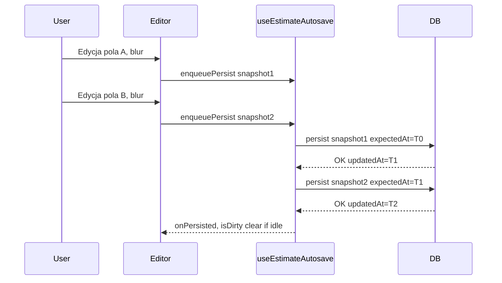

# Autosave kosztorysu — sekcje, pozycje i konflikty

Dokumentacja problemów z zapisem edytora kosztorysu (czerwiec 2026) oraz wdrożonych poprawek. Kontekst UI: [`estimates-view-edit-ui.md`](estimates-view-edit-ui.md). Model danych: [`estimates.md`](estimates.md).

---

## Skrót architektury

```txt
EstimateEditor (client)
  ├─ sections / marginPercent — React state (sectionsRef + commitSections)
  ├─ triggerSave() — debounce 3 s (onChange)
  ├─ triggerBlurSave() — natychmiast (onBlur pola / mobile Save)
  └─ useEstimateAutosave
        └─ enqueuePersist → kolejka single-flight
              └─ autoSaveAction → autoSave() w repository

Struktura (dodaj/usuń sekcję/pozycję): addSectionAction / addLineItemAction — od razu w DB.
Treść (tytuł sekcji, pola pozycji, marża): autosave — pełny payload sections + marginPercent.
```

---

## Problem 1: Znikające nazwy sekcji i pozycji po zapisie

### Objawy

- Po dodaniu sekcji, nadaniu nazwy, dodaniu pozycji i kliknięciu **Zapisz** (mobile) lub blur (desktop) UI wraca do domyślnych tytułów (`Nowa sekcja`, puste nazwy pozycji).
- Dotyczyło mobile i desktopu; użytkownik zgłaszał regresję po ok. 5–7 czerwca 2026.

### Przyczyna (dwa błędy naraz)

**A. Niedokończony autosave**

- `AutoSaveData.sections` było zdefiniowane w typach i `upsertSection` / `upsertLineItem` istniały w repository, ale **nigdy nie były wywoływane**.
- `triggerSave` / `triggerBlurSave` wysyłały wyłącznie `{ marginPercent }`.
- `addSectionAction` / `addLineItemAction` zapisywały w DB tylko strukturę z domyślnymi wartościami (`"New section"`, `name: ""`).

**B. Nadpisywanie stanu klienta po odświeżeniu RSC**

- Commit `19225dc` dodał `useEffect`, który przy każdej zmianie propa `versionTree` wywoływał `applyVersionTree()` i **nadpisywał** lokalny stan serwerem.
- W App Router **każda server action** (w tym `autoSaveAction`) może odświeżyć payload RSC — nawet bez `revalidatePath`.
- Po autosave serwer zwracał drzewo z domyślnymi tytułami → UI traciło edycje użytkownika.

Dodatkowo `editorKey` zawierał `updatedAt`, co remountowało edytor po każdym autosave.

### Rozwiązanie

| Warstwa | Plik | Zmiana |
| --- | --- | --- |
| Payload | [`sections-to-autosave.ts`](../../src/features/estimates/lib/sections-to-autosave.ts) | Mapowanie `SectionData[]` → `AutoSaveData.sections` |
| ID | [`persisted-entity-id.ts`](../../src/features/estimates/lib/persisted-entity-id.ts) | Tylko encje z persystowanym ID (bez `temp-`) |
| Persist | [`repository.ts`](../../src/features/estimates/server/repository.ts) `autoSave()` | `updateMany` sekcji/pozycji + `syncVersionTotals` |
| Editor | [`estimate-editor.tsx`](../../src/features/estimates/components/estimate-editor.tsx) | `commitSections`, `buildAutosavePayload`, pełny autosave |
| Sync | [`version-tree-sync.ts`](../../src/features/estimates/lib/version-tree-sync.ts) | Strażnik: nie stosuj `versionTree`, gdy `isDirty \|\| isSaving` |
| Strona | [`page.tsx`](../../src/app/[locale]/(dashboard)/dashboard/[workspaceSlug]/estimates/[estimateId]/page.tsx) | Usunięto `updatedAt` z `editorKey` |
| Mobile | [`estimate-mobile-*-sheet.tsx`](../../src/features/estimates/components/) | `await onBlur()` przed zamknięciem arkusza |

**Synchronizacja `versionTree` (nie wyłączamy jej całkowicie):**

- Stosuj serwerowe drzewo gdy: koniec generowania AI, `forceApply` (konflikt → Odśwież), AI mutation, edytor „czysty”.
- Pomiń gdy: `isDirty` lub trwa zapis — chroni przed nadpisaniem w trakcie edycji.

**Tworzenie sekcji/pozycji:**

- Encja trafia do stanu React **dopiero po** sukcesie `addSectionAction` / `addLineItemAction` (ID z Prisma).
- `commitSections()` aktualizuje `sectionsRef` synchronicznie, żeby autosave nie gubił świeżo utworzonego wiersza.

---

## Problem 2: Fałszywy „Konflikt — odśwież” przy szybkiej edycji wiersza (desktop)

### Objawy

- Szybkie przejście między polami w jednym wierszu (nazwa → jednostka → ilość) powoduje banery **Konflikt — odśwież** / **Błąd zapisu**.
- Powolna edycja pole po polu (czekanie na „Zapisano”) działa poprawnie.

### Przyczyna

- Każde **onBlur** pola wywołuje natychmiastowy `autoSaveAction`.
- Każdy **onChange** planuje debounced autosave (3 s).
- Wiele wywołań `persist()` szło **równolegle** z tym samym `expectedUpdatedAt`.
- Pierwszy zapis podnosi `updatedAt` w DB; drugi dostaje `conflict: true` (optymistyczna kontrola wersji w `autoSave()`).
- Dodatkowo `onPersisted` zerowało `isDirty` nawet gdy użytkownik edytował inne pole w trakcie zapisu.

### Rozwiązanie

| Element | Opis |
| --- | --- |
| **Kolejka single-flight** | Wszystkie zapisy przez `enqueuePersist()` — jeden request na raz, każdy następny używa świeżego `updatedAtRef` po sukcesie poprzedniego |
| **Koalescencja** | `queuedPayloadRef` zawsze trzyma najnowszy snapshot |
| **Blur + debounce** | Ten sam pipeline; blur anuluje timer debounce |
| **Retry** | Przy `conflict`: `getVersionUpdatedAtAction` + jedna ponowna próba; UI konfliktu dopiero po drugiej porażce |
| **`dirtyGenerationRef`** | `isDirty` czyszczone tylko gdy kolejka pusta i brak nowych edycji od startu zapisu |
| **Ochrona `updatedAtRef`** | `initialUpdatedAt` z props nie nadpisuje refa podczas `persistInFlight` |

Implementacja: [`use-estimate-autosave.ts`](../../src/features/estimates/hooks/use-estimate-autosave.ts).

---

## Diagram: zapis po poprawkach



---

## Pliki kluczowe

| Plik | Rola |
| --- | --- |
| `src/features/estimates/hooks/use-estimate-autosave.ts` | Debounce, kolejka, retry, status UI |
| `src/features/estimates/lib/sections-to-autosave.ts` | Budowa payloadu + filtr ID |
| `src/features/estimates/lib/version-tree-sync.ts` | `shouldApplyVersionTreeFromServer` |
| `src/features/estimates/server/repository.ts` | `autoSave`, `getVersionUpdatedAt` |
| `src/features/estimates/server/actions.ts` | `autoSaveAction`, `getVersionUpdatedAtAction` |
| `src/features/estimates/components/estimate-editor.tsx` | Stan sekcji, strażniki sync, triggery |

---

## Zasady na przyszłość

1. **Nie wysyłaj tylko `marginPercent`**, jeśli edytor trzyma treść sekcji/pozycji w stanie klienckim — autosave musi persistować całe drzewo (lub dedykowane akcje per pole).
2. **Nie wywołuj `applyVersionTree` bezwarunkowo** na każdą zmianę propa — respektuj `isDirty` / `isSaving` albo jawne zdarzenia (AI, generowanie, odśwież po konflikcie).
3. **Serializuj zapisy** do jednej wersji (`expectedUpdatedAt`) — równoległe `autoSaveAction` z tym samym timestampem dają fałszywy konflikt.
4. **Nowe encje:** najpierw server action z ID z DB, potem edycja i autosave; w payloadzie tylko `isPersistedEntityId`.
5. **`editorKey`:** nie używaj `updatedAt` jeśli autosave go zmienia — powoduje remount i utratę fokusu.
6. **Mobile Save:** `await onBlur()` przed zamknięciem sheetu, żeby RSC refresh nie wygrał wyścigu z persist.

---

## Weryfikacja manualna

1. Dodaj sekcję → zmień nazwę → dodaj pozycję → wypełnij pola → Zapisz / blur — wartości zostają; hard refresh potwierdza DB.
2. Desktop: szybko tabuj przez nazwa / j.m. / ilość / cena — brak „Konflikt”.
3. Marża tylko — autosave bez remountu edytora.
4. `?v=` — przełączenie wersji ładuje właściwe drzewo.
5. Dwa taby, równoczesna edycja — po retry nadal konflikt (prawdziwy multi-user).

---

## Powiązane commity / data

- Regresja sync: `19225dc` (`applyVersionTree` na każdy `versionTree`).
- Mobile Save + blur: `1176e16`.
- Poprawka autosave sekcji/pozycji + konflikty szybkiej edycji: staging, czerwiec 2026.
