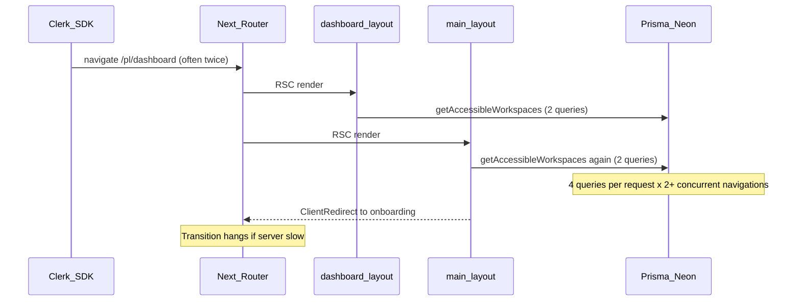

# Blank dashboard / perpetual "Rendering..." after email+password login

**Date:** 2026-06-01  
**Status:** Resolved  
**Affected:** Post-login navigation to `/[locale]/dashboard` (especially new users → onboarding redirect)

## Symptom

After email/password sign-in:

- URL often lands on `/pl/dashboard` briefly
- Sidebar may render (workspace list, nav, user header)
- Main content area stays blank (dashboard home page intentionally returns `null`)
- Next.js dev overlay shows **"Rendering..."** and it never settles
- Network tab: `dashboard?_rsc` may show canceled; one or more `onboarding?_rsc` requests can stay open for tens of seconds
- OAuth login did not reproduce the issue (full page reload vs soft navigation)

Related flows that **continued to work** after the fix: invite-only user → `/dashboard/invitations` → decline → `/dashboard/onboarding`.

## What was NOT the root cause

- **Client-side render loop on onboarding** — onboarding client tree has only one-shot effects (`ThemeToggle` mount guard, `CreateWorkspaceForm` pending sync). No mount-time `router.push` except form submit.
- **`(main)/page.tsx` returning `null`** — blank main panel on `/dashboard` is intentional; not a missing page component.
- **MFA / sign-in continue** — separate issue on untrusted devices; trusted-device login bypasses 2FA and reaches dashboard directly.

## Root cause (primary)

**Duplicate, uncached server data fetches across nested layouts under concurrent RSC requests.**

### Call graph (single navigation to `/dashboard`)

Before the fix:

1. [`(dashboard)/layout.tsx`](../../src/app/[locale]/(dashboard)/layout.tsx) called `getAccessibleWorkspaces(userId)` → 2 Prisma queries (owned + member).
2. [`(main)/layout.tsx`](../../src/app/[locale]/(dashboard)/dashboard/(main)/layout.tsx) called `checkDashboardHomeAccess` → `countAccessibleWorkspaces` → **another** `getAccessibleWorkspaces` → 2 more queries.
3. No `cache()` — both calls were independent round-trips in the same RSC pass.
4. Clerk soft-navigates to `/dashboard` **twice** after password login (`routing="path"` + `bar.html` session sync). That created multiple concurrent RSC renders, each doing 4+ workspace queries, competing for Neon pooler connections.
5. Slow or queued DB work kept RSC streams open → client router stayed in transition → **"Rendering..."** indefinitely.

Under load, the outer and inner layout could also theoretically disagree on workspace count (queries at different times), contributing to confusing UI (sidebar with data while redirect to onboarding was in flight).

## Root cause (secondary)

**`ClientRedirect` could fire `router.replace` more than once** if the effect re-ran (e.g. `router` reference change while a slow RSC stream was still open). This compounded an already-stuck transition but did not cause the initial DB pile-up.

React Strict Mode double-mount creates a **new** component instance, so `useRef` does **not** block Strict Mode’s second `router.replace` — the guard helps dependency-driven re-runs, not double-mount.

## Fixes applied

| Change | File | Role |
| --- | --- | --- |
| **`cache(getAccessibleWorkspaces)`** | [`accessible-workspaces.ts`](../../src/features/workspaces/server/accessible-workspaces.ts) | **Primary fix** — one DB round-trip per `userId` per RSC request; layouts share the same result |
| **Short-circuit when `workspaces.length === 0`** | [`(dashboard)/layout.tsx`](../../src/app/[locale]/(dashboard)/layout.tsx) | Skips ~1900ms sidebar waterfall for new users heading to onboarding |
| **`ClientRedirect` idempotency `useRef`** | [`client-redirect.tsx`](../../src/components/routing/client-redirect.tsx) | Reduces duplicate `router.replace` during slow transitions |
| **Removed `(dashboard)/loading.tsx`** | deleted | Removed outer Suspense boundary that extended RSC stream scope |
| **Test credentials** | `.env.test.local`, [`.cursor/rules/debugging.mdc`](../../.cursor/rules/debugging.mdc) | Agent/human debugging convention |

### Which fix mattered most?

**`cache(getAccessibleWorkspaces)`** — cuts duplicate queries and keeps layout guards consistent. The short-circuit helps new-user path latency; the redirect guard is defensive.

## Patterns to reuse (checklist)

When you see **perpetual "Rendering..."**, **stuck soft navigation**, or **canceled `?_rsc` requests**:

1. **Map nested layouts** — list every `layout.tsx` on the route and every async server call; look for the same data fetched twice (auth user, workspace list, entitlements).
2. **Wrap shared server loaders with `cache()` from `react`** — same arguments in one RSC request → one execution. Especially for functions called from both a parent layout and a child layout/guard.
3. **Count concurrent navigations** — Clerk/email login often triggers multiple `navigate()` calls; multiply DB load by number of in-flight RSC requests (client cancel does not instantly stop server work).
4. **Short-circuit expensive layouts** when a child guard will redirect anyway (e.g. zero workspaces → skip billing/invitations/member fetches).
5. **Prefer server `redirect()` on full page loads**; use [`ClientRedirect`](../../src/components/routing/client-redirect.tsx) only where soft navigation + nested layouts required it — and guard client redirects against duplicate `replace`.
6. **Be careful adding `loading.tsx`** — outer Suspense boundaries keep streams open until all parent async work finishes.
7. **Reproduce with Network Preserve log** — look for duplicate `?_rsc` to the same route, canceled parent segment, long-pending child segment.

## Code references

- Workspace access: [`getAccessibleWorkspaces`](../../src/features/workspaces/server/accessible-workspaces.ts) (must stay `cache()`-wrapped)
- Dashboard guards: [`dashboard-route.ts`](../../src/server/workspaces/dashboard-route.ts)
- Onboarding product rules: [`docs/features/workspace-onboarding.md`](../features/workspace-onboarding.md)

## Debugging this app

- Test account: `.env.test.local` (`TEST_USER_EMAIL`, `TEST_USER_PASSWORD`)
- Cursor IDE browser cannot reach `localhost` — use Chrome DevTools locally or see [debugging rule](../../.cursor/rules/debugging.mdc)

## Not fixed (accepted trade-off)

Clerk may still fire two soft navigations to `/dashboard` after email/password login. With `cache()` and the zero-workspace short-circuit, each cycle completes quickly enough to be imperceptible. Optional follow-up: `<SignIn.Root routing="virtual">` to reduce Clerk path navigations (changes URL behavior during sign-in).
