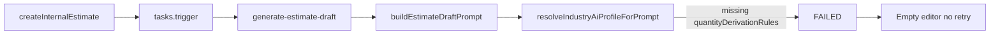
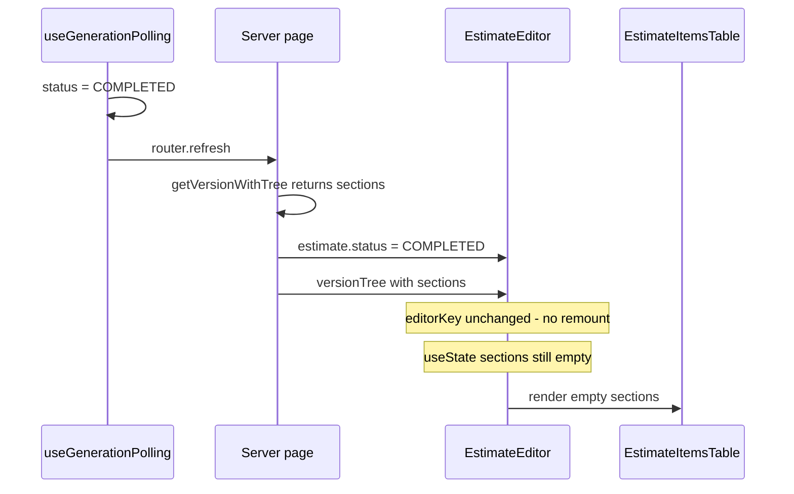

# AI estimate draft - generation crash and blank editor after completion

**Date:** 2026-06-05  
**Status:** Resolved (commit `19225dc`)  
**Affected:** Manual and public estimate creation → async draft via Trigger.dev → estimate editor at `/[locale]/dashboard/[workspaceSlug]/estimates/[estimateId]`  
**Industries impacted:** Primarily `ELECTRICAL` (missing profile field); post-generation sync bug affected all industries

Two related bugs appeared in the same flow. Part A prevented draft generation from succeeding. Part B left the editor empty after a **successful** job until a full page refresh.

---

## Part A - Generation never populated sections (FAILED job)

### Symptom

After creating an estimate manually (dashboard → Wyceny → new estimate):

- User is redirected to the estimate editor as expected.
- Main table stays empty: “Brak sekcji. Dodaj pierwszą, aby rozpocząć budowanie wyceny.”
- No AI activity in the assistant panel; totals remain `0,00 zł`.
- No generating skeleton (job failed quickly, before user perceived “in progress”).
- No visible error or retry affordance in the editor.

**Database (example: workspace `marek-phu`, estimate `cmq101sre00ylufiwmr88d97d`):**

- `estimateRequest.status`: `FAILED`
- `aiMetadata.error`: `Cannot read properties of undefined (reading 'pl')`
- `latestVersion.sections`: `[]`
- Job failed ~2 seconds after create (`14:08:21` → `14:08:23`).

### What was NOT the root cause

- **Redirect timing** - landing on the editor immediately after create is correct.
- **OpenAI API / network failure** - error occurred before the OpenAI call, during prompt assembly.
- **Trigger.dev not running** - task did run and wrote `FAILED` status (when worker is down, status stays `PENDING` and skeleton shows indefinitely).
- **`tasks.trigger()` not firing** - `createInternalEstimate` does call `generate-estimate-draft`.

### Root cause

[`resolveIndustryAiProfileForPrompt`](../../src/ai/config/industry-ai-profiles.ts) accessed `profile.quantityDerivationRules[lang]` unconditionally. Only `CONSTRUCTION` defined `quantityDerivationRules`; `ELECTRICAL` (and `PLUMBING`, `CARPENTRY`, `OTHER`) omitted it.

Crash site: [`buildEstimateDraftPrompt`](../../src/ai/prompts/estimate-draft.ts) → `resolveIndustryAiProfileForPrompt` → `undefined['pl']`.



### Secondary UX gap

Failed-state UI lived only inside [`EstimateGeneratingSkeleton`](../../src/features/estimates/components/estimate-generating-skeleton.tsx), which renders while `requestStatus` is `PENDING` or `PROCESSING`. When status became `FAILED`, `isGenerating` was false, so the skeleton (and its error message) never appeared - only an empty table.

### Fixes (Part A)

| Change | File |
| --- | --- |
| Make `quantityDerivationRules` optional; omit block from prompt when absent | [`industry-ai-profiles.ts`](../../src/ai/config/industry-ai-profiles.ts), [`estimate-draft.ts`](../../src/ai/prompts/estimate-draft.ts) |
| Add quantity rules for ELECTRICAL, PLUMBING, CARPENTRY, OTHER | [`industry-ai-profiles.ts`](../../src/ai/config/industry-ai-profiles.ts) |
| Admin read-only panel: profile completeness + quantity rules table | [`industry-ai-profiles-admin-panel.tsx`](../../src/features/workspaces/components/industry-ai-profiles-admin-panel.tsx), [`industry-fields/page.tsx`](../../src/app/[locale]/(dashboard)/dashboard/admin/industry-fields/page.tsx) |
| Retry AI generation (`FAILED` + zero sections only) | [`service.ts`](../../src/features/estimates/server/service.ts), [`actions.ts`](../../src/features/estimates/server/actions.ts), [`estimate-generation-failed-banner.tsx`](../../src/features/estimates/components/estimate-generation-failed-banner.tsx) |
| Document optional field | [`industry-ai-profiles.md`](../features/industry-ai-profiles.md) |

**Retry constraint:** [`generate-estimate-draft.ts`](../../src/trigger/generate-estimate-draft.ts) skips requests already `COMPLETED` or `FAILED`. Retry resets status to `PENDING` before re-triggering.

---

## Part B - Table blank after successful generation until page refresh

### Symptom

After Part A was fixed (or on a successful first run):

- Generating skeleton and “Generating estimate with AI” display correctly.
- When the job completes, skeleton disappears but the items table remains empty.
- Summary rail stays at `0,00 zł`.
- **Manual page refresh (F5)** shows populated sections and totals.
- Same behavior on **Retry AI generation** after a prior failure.

### What was NOT the root cause

- **Data not saved** - sections existed in DB after refresh; failure was client-side display only.
- **Polling not detecting completion** - `useGenerationPolling` reached `COMPLETED` and called `router.refresh()`.

### Root cause (two factors)



**1. Stale client state**

[`EstimateEditor`](../../src/features/estimates/components/estimate-editor.tsx) initializes `sections` from `versionTree` via `useState` once. `router.refresh()` updates RSC props but does not re-run the initializer. `applyVersionTree` existed for AI edit mutations but was not called when async draft generation finished.

**2. Stale remount key**

[`page.tsx`](../../src/app/[locale]/(dashboard)/dashboard/[workspaceSlug]/estimates/[estimateId]/page.tsx) used:

```ts
const editorKey = `${activeVersionId}-${serializedTree?.updatedAt}`;
```

After draft generation, sections and line items are inserted but [`EstimateVersion.updatedAt`](../../prisma/schema.prisma) often stayed unchanged because:

- [`generate-estimate-draft.ts`](../../src/trigger/generate-estimate-draft.ts) only updated the version row when `suggestedMarginPercent` was set.
- [`syncVersionTotals`](../../src/features/estimates/lib/sync-version-totals.ts) uses `$executeRaw` for `totalNet`/`totalGross`, bypassing Prisma `@updatedAt`.

So `router.refresh()` fetched new tree data, but React kept the same `EstimateEditor` instance with empty local state. A **full page reload** worked because it remounted the component and re-ran `useState` initialization.

### Fixes (Part B)

| Change | File |
| --- | --- |
| `useEffect` → `applyVersionTree(versionTree)` when `!isGenerating` | [`estimate-editor.tsx`](../../src/features/estimates/components/estimate-editor.tsx) |
| `editorKey` includes `sectionCount` + `requestStatus` | [`page.tsx`](../../src/app/[locale]/(dashboard)/dashboard/[workspaceSlug]/estimates/[estimateId]/page.tsx) |
| Explicit `estimateVersion.update({ updatedAt })` after draft save | [`generate-estimate-draft.ts`](../../src/trigger/generate-estimate-draft.ts) |

---

## Patterns to reuse (checklist)

When you see **empty estimate table** or **AI draft not appearing**:

1. **Check `EstimateRequest` in DB** - `status`, `aiMetadata.error`, `projectDescription`. `FAILED` + JS property error → industry AI profile assembly.
2. **Confirm Trigger.dev worker** - local dev needs `npx trigger.dev@latest dev` alongside `npm run dev`. If worker is down, status stays `PENDING` (skeleton forever), not `FAILED`.
3. **Inspect industry profiles (admin)** - `/[locale]/dashboard/admin/industry-fields` → “Industry AI profiles” panel; look for `Missing` on `quantityDerivationRules` or other fields.
4. **Skeleton works but table empty after completion** - compare server `versionTree` (sections in DB) vs client `sections` state; check whether `editorKey` changes on completion; verify `EstimateVersion.updatedAt` after async writes.
5. **Retry path** - only offered when `FAILED` and section count is zero; resets request to `PENDING` then re-triggers job.

## Verification

1. Create estimate on an electrical workspace with Trigger.dev running → skeleton → populated table **without** manual refresh.
2. Open a `FAILED` empty estimate → failed banner + **Retry AI generation** → skeleton → populated table.
3. Manual editing: type in a line item; confirm local state is not reset unexpectedly.
4. Admin: switch industries on Industry fields page; completeness badges and quantity-rules table render.

## Code references

| Area | Path |
| --- | --- |
| Industry AI profiles | [`src/ai/config/industry-ai-profiles.ts`](../../src/ai/config/industry-ai-profiles.ts) |
| Draft prompt | [`src/ai/prompts/estimate-draft.ts`](../../src/ai/prompts/estimate-draft.ts) |
| Trigger task | [`src/trigger/generate-estimate-draft.ts`](../../src/trigger/generate-estimate-draft.ts) |
| Editor + sync | [`src/features/estimates/components/estimate-editor.tsx`](../../src/features/estimates/components/estimate-editor.tsx) |
| Editor page + key | [`src/app/.../estimates/[estimateId]/page.tsx`](../../src/app/[locale]/(dashboard)/dashboard/[workspaceSlug]/estimates/[estimateId]/page.tsx) |
| Polling | [`src/features/estimates/hooks/use-generation-polling.ts`](../../src/features/estimates/hooks/use-generation-polling.ts) |
| Architecture overview | [`docs/architecture/estimate-ai.md`](../architecture/estimate-ai.md) |

## Related incidents

- [Estimate draft stuck PROCESSING / Trigger timeout](./2026-06-05-estimate-draft-stuck-processing.md) - skeleton never finishes; run hits `maxDuration`; DB orphaned at `PROCESSING` (commit `ebf2134`).

## Optional follow-up

If users still see a brief empty flash after skeleton disappears, consider eager fetch on `COMPLETED`: server action returns `versionTree`, `applyVersionTree` runs before `router.refresh()`. Not implemented in `19225dc`; Fixes 1–3 were sufficient in testing.
