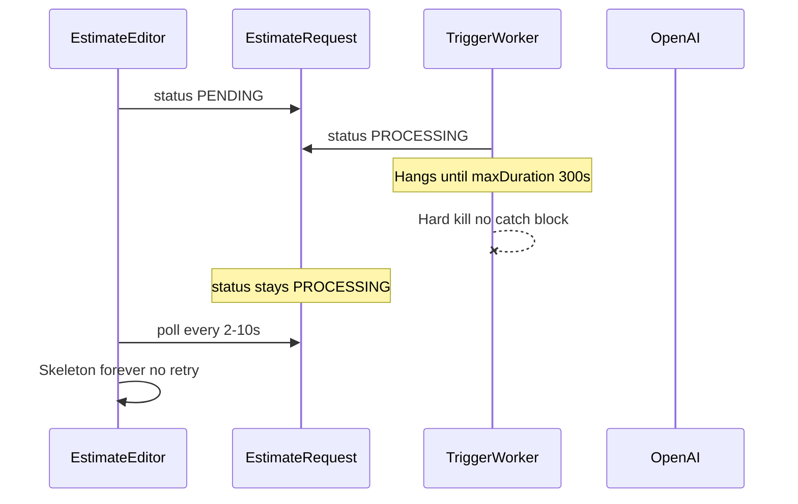

# AI estimate draft — Trigger timeout and perpetual generating skeleton

**Date:** 2026-06-05  
**Status:** Resolved (commit `ebf2134`)  
**Affected:** Manual estimate creation → async draft via Trigger.dev → estimate editor at `/[locale]/dashboard/[workspaceSlug]/estimates/[estimateId]`  
**Related:** [AI estimate draft blank editor](./2026-06-05-ai-estimate-draft-blank-editor.md) (same flow, different failure modes)

Large or complex estimates could hang inside the `generate-estimate-draft` task until Trigger.dev killed the run at `maxDuration`. The database row stayed `PROCESSING`, so the editor showed the generating skeleton indefinitely with no retry path.

---

## Symptom

After creating a large estimate manually (dashboard → Wyceny → new estimate, e.g. “Duże mieszkanie deweloperskie – Wersja 1”):

- User is redirected to the estimate editor as expected.
- Main area shows the generating skeleton and **“AI generuje szkic wyceny…”** indefinitely.
- Skeleton loader bars pulse; no sections appear.
- Trigger.dev dashboard: run `run_cmq15jutn57c80on2arwh277v` stays **Executing** for ~5 minutes, then **Error**.
- OpenAI dashboard: **no request** logged for that run.
- Browser console may show `A listener indicated an asynchronous response by returning true, but the message channel closed before a response was received` — this is Chrome extension noise, unrelated to the app.

**Example IDs (Esteo Dev Workspace):**

- Estimate: `cmq15js50009fufvgabf1w612`
- `EstimateRequest`: `cmq15jsa1009jufvgshucqw22`
- Request number: `ER-2026-00003`

**Database (at time of incident):**

- `estimateRequest.status`: `PROCESSING` (orphaned after Trigger run failed)
- `latestVersion.sections`: `[]`

**Local Trigger worker log:**

```
18:42:21 → generate-estimate-draft started
18:47:21 → Error (exactly 300s later)
```

Prior runs the same day completed in **5–11 seconds**.

---

## What was NOT the root cause

- **Trigger.dev worker not running** — the run dequeued, started, and executed for 5 minutes. When the worker is down, status stays `PENDING` (skeleton forever) without a failed run in the dashboard.
- **Industry AI profile crash** — see [Part A of the related incident](./2026-06-05-ai-estimate-draft-blank-editor.md): that fails in ~2s with `FAILED` and `Cannot read properties of undefined (reading 'pl')`.
- **Frontend polling broken** — `getGenerationStatusAction` correctly returned `PROCESSING`; the UI behaved as designed for that status.
- **Blank editor after successful generation** — see [Part B of the related incident](./2026-06-05-ai-estimate-draft-blank-editor.md): sections exist in DB but client state is stale.
- **Browser console extension errors** — unrelated Chrome extension message-passing failures.

---

## Root cause (confirmed)



| Layer | Cause |
| --- | --- |
| **Task timeout** | [`generate-estimate-draft.ts`](../../src/trigger/generate-estimate-draft.ts) sets `maxDuration: 300`. Run duration matched exactly 300s before error. |
| **Orphaned DB status** | When Trigger hard-kills a run at `maxDuration`, the `catch` block in `run()` does not execute → `EstimateRequest.status` remains `PROCESSING`. |
| **No recovery UX** | Retry required `FAILED` only; skeleton renders for `PENDING`/`PROCESSING` but offered no retry on client timeout (refresh only). |

---

## Root cause (hang — open investigation)

**Where the 300 seconds was spent is not confirmed.** At incident time there was no milestone logging between `PROCESSING` and task completion.

Likely stall points (in order of suspicion):

1. **`generateObject()`** — large CONSTRUCTION prompt with scope-expansion rules for turnkey developer apartments may produce a very large structured output. Absence of OpenAI logs is suspicious but not definitive (wrong project/time window, or request never completed handshake).
2. **Pre-OpenAI Prisma I/O** — `loadEstimateGenerationContext` / `buildProjectBrief` (~8 queries). Less likely given fast prior runs the same day on the same workspace.

**After fix (`ebf2134`):** check Trigger.dev logs for the last milestone message:

| Log message | Implies stall is after… |
| --- | --- |
| `Estimate draft generation started` | Task entry |
| `Loading estimate generation context` | Initial DB reads |
| `Building project brief` | Context load |
| `Calling OpenAI for estimate draft` | Brief + prompt assembly |
| `OpenAI estimate draft returned` | OpenAI call |
| `Estimate draft saved successfully` | DB transaction |

Dev worker also logs `[generateEstimateDraft] prompt length: N` before the OpenAI call.

---

## Fixes applied (`ebf2134`)

| Change | File |
| --- | --- |
| `markEstimateRequestFailed()` helper (only updates `PENDING`/`PROCESSING`) | [`generate-estimate-draft.ts`](../../src/trigger/generate-estimate-draft.ts) |
| `onFailure` lifecycle hook | [`generate-estimate-draft.ts`](../../src/trigger/generate-estimate-draft.ts) |
| `onComplete` lifecycle hook (backup when run ends without success) | [`generate-estimate-draft.ts`](../../src/trigger/generate-estimate-draft.ts) |
| Milestone logs through the run | [`generate-estimate-draft.ts`](../../src/trigger/generate-estimate-draft.ts) |
| Dev prompt length log | [`generate-estimate-draft.ts`](../../src/ai/services/generate-estimate-draft.ts) |
| Retry allowed for `PROCESSING` + zero sections | [`service.ts`](../../src/features/estimates/server/service.ts) |
| Retry button on client timeout and `FAILED` skeleton | [`estimate-generating-skeleton.tsx`](../../src/features/estimates/components/estimate-generating-skeleton.tsx) |
| Pass `workspaceId` for retry action | [`estimate-editor.tsx`](../../src/features/estimates/components/estimate-editor.tsx) |
| `npm run trigger:dev` script | [`package.json`](../../package.json) |

**Caveat:** Trigger.dev docs state `onFailure` does not fire for some system-level failures (including possible `maxDuration` kills). `onComplete` and UI retry from `PROCESSING` remain the safety net.

**Retry constraint:** Still requires zero sections and editable version. Resets status to `PENDING` before re-triggering.

---

## Patterns to reuse (checklist)

When the generating skeleton runs **5+ minutes** and Trigger shows a long-running or failed run:

1. **Compare run duration to `maxDuration`** (300s) in Trigger dashboard.
2. **Check `EstimateRequest.status` in DB** — `PROCESSING` after a failed run = orphaned state.
3. **Read milestone logs** (post-fix) to find the last completed step before stall.
4. **Check OpenAI logs** only after confirming `Calling OpenAI for estimate draft` appeared in Trigger logs.
5. **Confirm local worker** — `npm run trigger:dev` alongside `npm run dev`.
6. **Distinguish related incidents:**
   - `FAILED` in ~2s + `reading 'pl'` → [profile crash / blank editor Part A](./2026-06-05-ai-estimate-draft-blank-editor.md)
   - Skeleton disappears, table empty, refresh fixes → [blank editor Part B](./2026-06-05-ai-estimate-draft-blank-editor.md)
   - Skeleton forever, run errors at 5m, `PROCESSING` in DB → **this incident**

---

## Manual recovery

**Before deploy / emergency:**

1. Set `EstimateRequest.status` to `FAILED` in Prisma Studio (or SQL update).
2. Refresh the estimate page → failed UI or retry affordance.
3. Cancel stale Trigger run in dashboard if still marked executing.

**After deploy:**

- Wait for client 5-minute timeout → click **Ponów generowanie AI**, or
- Retry while status is still `PROCESSING` (zero sections).

---

## Verification

1. Orphaned `PROCESSING` request → timeout UI shows retry → new Trigger run starts.
2. Thrown error in task → `onFailure` sets `FAILED` with `aiMetadata.error`.
3. Next slow or failing run → Trigger logs show milestone timestamps for diagnosis.
4. `npm run trigger:dev` starts worker without looking up the npx command.

---

## Deferred (until hang root cause confirmed)

- Increase `maxDuration` beyond 300s
- OpenAI `abortSignal` timeout on `generateObject`
- Prompt/output size limits or chunked generation

---

## Code references

| Area | Path |
| --- | --- |
| Trigger task + lifecycle hooks | [`src/trigger/generate-estimate-draft.ts`](../../src/trigger/generate-estimate-draft.ts) |
| OpenAI call | [`src/ai/services/generate-estimate-draft.ts`](../../src/ai/services/generate-estimate-draft.ts) |
| Retry service | [`src/features/estimates/server/service.ts`](../../src/features/estimates/server/service.ts) |
| Generating skeleton + retry | [`src/features/estimates/components/estimate-generating-skeleton.tsx`](../../src/features/estimates/components/estimate-generating-skeleton.tsx) |
| Polling | [`src/features/estimates/hooks/use-generation-polling.ts`](../../src/features/estimates/hooks/use-generation-polling.ts) |
| Architecture overview | [`docs/architecture/estimate-ai.md`](../architecture/estimate-ai.md) |
| Related incident (profile crash + blank table) | [`2026-06-05-ai-estimate-draft-blank-editor.md`](./2026-06-05-ai-estimate-draft-blank-editor.md) |
