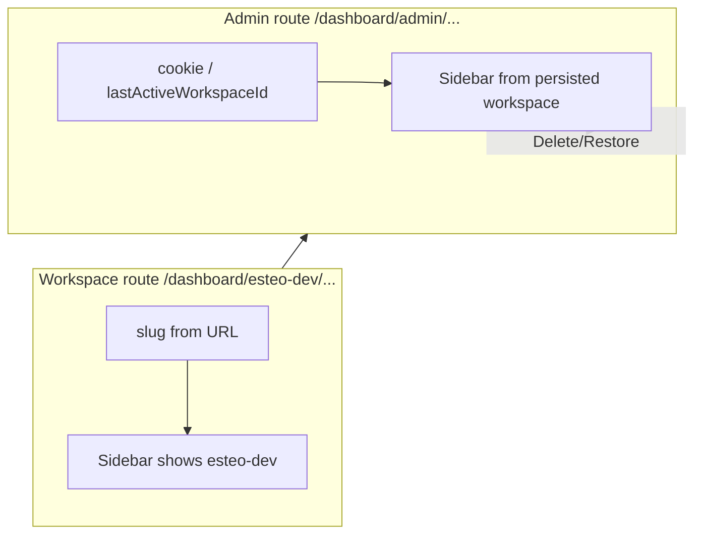

# Admin actions changed sidebar workspace / orphaned estimates

**Date:** 2026-06-07  
**Status:** Resolved  
**Affected:** Platform admins on `/dashboard/admin/estimate-requests` after **Delete** or **Restore**

## Symptom

1. Admin soft-deleted an estimate request from the admin panel. The request disappeared from the list, but the linked **estimate** remained visible in the workspace.
2. After **Delete** or **Restore** on admin estimate-request screens, the sidebar **active workspace card** appeared to jump (e.g. from `esteo-dev` to `test-512`) even though the URL stayed on `/dashboard/admin/...`.

## What was NOT the root cause

- Admin delete **intentionally** only soft-deleted `EstimateRequest` initially — no cascade to `Estimate` (fixed separately).
- Admin URLs do not (and should not) embed a workspace slug; admin layout correctly uses persisted active workspace (`resolveActiveWorkspace`).

## Root causes

### 1. Orphaned estimate after admin delete (data model)

`adminArchiveEstimateRequest` set `EstimateRequest.deletedAt` but left the linked `Estimate` active. Lists filter `EstimateRequest.deletedAt: null`, so the request vanished while the estimate still appeared in the workspace.

### 2. Sidebar jump after admin actions (UX)

Two mechanisms interacted:

| Factor | Detail |
| --- | --- |
| **Dual resolution** | [`(dashboard)/layout.tsx`](../../src/app/[locale]/(dashboard)/layout.tsx): workspace routes use URL slug; admin routes use cookie / `User.lastActiveWorkspaceId`. |
| **Stale cookie** | [`switchWorkspace`](../../src/components/layout/app-sidebar/workspace-context.tsx) navigated with `router.push` but did **not** call [`setActiveWorkspaceAction`](../../src/server/workspaces/actions.ts), so persisted workspace could differ from the last URL the user browsed. |
| **Full layout refresh** | Admin panel called `router.refresh()` after Delete/Restore, forcing the dashboard layout to re-resolve active workspace from cookie on an admin URL — making a mismatch visible as a “jump”. |

## Fixes applied

| Change | Files | Role |
| --- | --- | --- |
| **Cascade soft delete / restore** | [`admin-estimate-requests.ts`](../../src/features/estimate-requests/server/admin-estimate-requests.ts) | Delete: set `deletedAt` on request + linked estimate. Restore: clear both. |
| **Admin restore + show deleted** | Panel, detail actions, `admin-actions.ts`, i18n | Restore action; `showDeleted=1` toggle (admin-only); detail view for deleted requests. |
| **Persist on explicit switch** | [`workspace-context.tsx`](../../src/components/layout/app-sidebar/workspace-context.tsx) | `switchWorkspace` → `await setActiveWorkspaceAction` → `router.push` (no extra refresh). |
| **Remove admin `router.refresh()`** | [`admin-estimate-requests-panel.tsx`](../../src/features/estimate-requests/components/admin-estimate-requests-panel.tsx), [`admin-estimate-request-detail-actions.tsx`](../../src/features/estimate-requests/components/admin-estimate-request-detail-actions.tsx) | Optimistic UI + server `revalidatePath` suffice; avoids layout re-fetch on admin. |
| **Slug mismatch fallback** | `workspace-context.tsx` `useEffect` | Still refreshes when URL slug and layout props disagree (unchanged safety net). |

### URL → cookie sync on every workspace visit

**Not implemented.** After persist-on-switch and removing admin refresh, the reported jump should be gone. A blanket URL→cookie `useEffect` was deferred unless manual QA shows the bug persists when using the switcher → admin → action flow.

## Patterns to reuse

- Admin mutations: prefer **optimistic client state + `revalidatePath` on server** over **`router.refresh()`** on admin routes (shared dashboard layout re-resolves persisted workspace).
- **Explicit workspace switch** must call `setActiveWorkspaceAction` before navigation so admin routes match user intent.
- Soft delete of an **entry point** (`EstimateRequest`) with a linked **artifact** (`Estimate`): decide cascade policy up front (hide both vs unlink vs block delete).

## Related

- Active workspace resolution: [`docs/features/workspace-onboarding.md`](../features/workspace-onboarding.md#active-workspace-resolution)
- Estimate request admin panel: [`src/features/estimate-requests/server/admin-estimate-requests.ts`](../../src/features/estimate-requests/server/admin-estimate-requests.ts)
