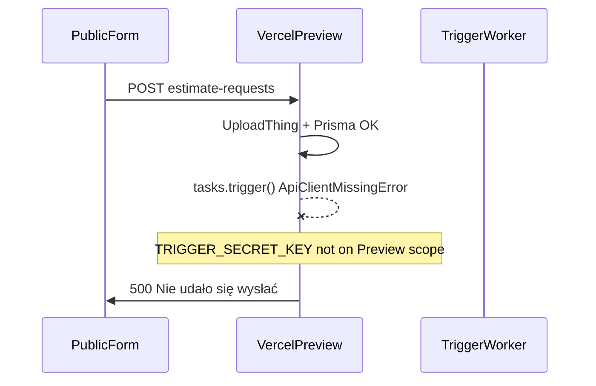

# Trigger.dev + Vercel Preview - public estimate submit 500

**Date:** 2026-06-08  
**Status:** Resolved  
**Affected:** Public estimate request form on Vercel Preview (`staging` branch) → `POST /api/public/estimate-requests`  
**Related:** [Deployment and environments](../architecture/deployment.md)

Submitting a public estimate request on Vercel Preview returned HTTP 500 with „Nie udało się wysłać zgłoszenia…”. No runs appeared in the expected Trigger.dev Production environment. After fixing env scoping and introducing a separate **Esteo-Staging** Trigger project, submit + attachments + AI draft succeeded on Preview.

---

## Symptom

On Vercel Preview (branch `staging`):

- User fills public estimate request form and submits.
- Response: **500** - „Nie udało się wysłać zgłoszenia…”.
- Vercel function logs show failure during submit flow.
- Trigger.dev dashboard: **no runs** in the environment we were checking (or runs in wrong project).
- After fix: successful submit, **3 attachments** promoted, **AI draft** generated on Preview.

---

## Timeline of attempted fixes (not root causes)

These steps were tried before the final solution. Each addressed a real problem but was not sufficient alone.

| Step | What we tried | Result |
| --- | --- | --- |
| 1 | Add `trigger:build` / `npx trigger.dev build` to Vercel build | **Vercel build failed** - `build` is not a valid Trigger.dev CLI command |
| 2 | Briefly add `trigger:deploy` to Vercel build | Build issues; reverted to `next build` only |
| 3 | Use **main Esteo** `tr_prod_` key + staging Neon in one Trigger Production | Architectural conflict - staging Preview and future prod launch cannot share one Production bucket |
| 4 | Set `TRIGGER_SECRET_KEY` on Vercel **Production** only | **`ApiClientMissingError`** on Preview - key missing for Preview-scoped deployments |
| 5 | Misleading logs | Effect version warnings and UploadThing rollback messages during failed trigger - **noise**, not root cause |

---

## Root cause (confirmed)

| Layer | Cause |
| --- | --- |
| **Vercel env scoping** | `TRIGGER_SECRET_KEY` (and initially `TRIGGER_PROJECT_ID`) set for **Production** only, not **Preview**. Preview deployments cannot call `tasks.trigger()`. |
| **Single Trigger project mismatch** | Free tier has no Trigger Staging/Preview cloud env. Using main Esteo Production for staging data conflicts with future launch. |
| **Two env layers** | Next.js reads Vercel env; workers read Trigger dashboard env. Missing either layer breaks the chain. |

---

## Solution applied

### 1. Separate Trigger.dev project - **Esteo-Staging**

| Trigger project | Environment | Serves |
| --- | --- | --- |
| **Esteo-Staging** | **Production** | Vercel Preview (`staging` branch) |
| **Esteo** (main) | **Development** | localhost + `npm run trigger:dev` |
| **Esteo** (main) | **Production** | Vercel Production at launch (future) |

Example staging project ref (verify in dashboard): `proj_lkorkbyjorynapnptmqa`.

### 2. Vercel Preview environment variables

Both variables must have the **Preview** checkbox enabled:

| Variable | Source |
| --- | --- |
| `TRIGGER_PROJECT_ID` | Esteo-Staging project ref |
| `TRIGGER_SECRET_KEY` | Esteo-Staging → **Production** API key (`tr_prod_...`) |

### 3. Trigger Esteo-Staging → Production → Environment Variables

Worker secrets (not Vercel):

- `DATABASE_URL` - staging Neon (same as Vercel Preview)
- `OPENAI_API_KEY`
- `UPLOADTHING_TOKEN`

### 4. GitHub integration

**Esteo-Staging** → Production → branch `staging` - auto-deploy tasks on push.

### 5. Redeploy Preview

After env changes, redeploy latest Preview deployment so runtime picks up new variables.

**Outcome:** Public submit works; attachments upload and promote; `generate-estimate-draft` runs in Esteo-Staging Production.

---

## What was NOT the root cause

- **UploadThing ingest errors in logs** - appeared during rollback after trigger failure; uploads succeeded when trigger was fixed.
- **Effect version mismatch warnings** - SDK noise in Vercel logs.
- **Missing `trigger deploy` in Vercel build** - task deploy is via GitHub integration or manual CLI; build should remain `next build` only.
- **Clerk / Neon misconfiguration** - shared test/staging values were already correct for Preview.

---

## Lessons learned

| Lesson | Action |
| --- | --- |
| Vercel **Preview ≠ Production** for env vars | Always enable **Preview** checkbox for `TRIGGER_*` on staging branch deploys |
| Trigger **Production** ≠ Vercel Production | Esteo-Staging Trigger Production serves Vercel Preview |
| Worker env ≠ Vercel env | Set `DATABASE_URL`, `OPENAI_API_KEY`, `UPLOADTHING_TOKEN` in Trigger dashboard for the worker project |
| Free tier: no Trigger Preview env | Use **two Trigger projects** instead of one project with mixed staging/prod |
| Invalid CLI commands break CI | `npx trigger.dev build` does not exist; use `deploy` |
| Debug submit 500 | Filter Vercel logs for `[public estimate-requests]` - shows actual error, not Effect noise |

---

## Patterns to reuse (checklist)

When public estimate submit returns 500 on Vercel Preview:

1. **Vercel Logs** → `POST /api/public/estimate-requests` → `[public estimate-requests]` line.
2. **`ApiClientMissingError`** → add `TRIGGER_SECRET_KEY` with **Preview** scope; redeploy.
3. **Verify pair** - `TRIGGER_PROJECT_ID` and `TRIGGER_SECRET_KEY` from the **same** Trigger project (Esteo-Staging for Preview).
4. **Trigger dashboard** - Esteo-Staging → Production → Runs (not main Esteo unless localhost dev).
5. **Worker env** - confirm `DATABASE_URL`, `OPENAI_API_KEY`, `UPLOADTHING_TOKEN` in Trigger Staging Production.
6. **GitHub integration** - Esteo-Staging Production mapped to branch `staging`.
7. See full env map: [deployment.md](../architecture/deployment.md).

---

## Verification

1. Submit public estimate request on Preview URL (no attachments) → 200, request created.
2. Submit with multiple attachments → all files saved and promoted.
3. Esteo-Staging → Production → Runs shows `generate-estimate-draft` completed.
4. Estimate editor shows AI-generated sections after processing.

---

## Code references

| Area | Path |
| --- | --- |
| Public submit API | [`src/app/api/public/estimate-requests/route.ts`](../../src/app/api/public/estimate-requests/route.ts) |
| Submit + trigger call | [`src/features/estimate-requests/server/submit-estimate-request-with-attachments.ts`](../../src/features/estimate-requests/server/submit-estimate-request-with-attachments.ts) |
| Trigger task | [`src/trigger/generate-estimate-draft.ts`](../../src/trigger/generate-estimate-draft.ts) |
| Trigger config | [`trigger.config.ts`](../../trigger.config.ts) |
| Deploy scripts | [`package.json`](../../package.json) |
| Deployment guide | [`docs/architecture/deployment.md`](../architecture/deployment.md) |
