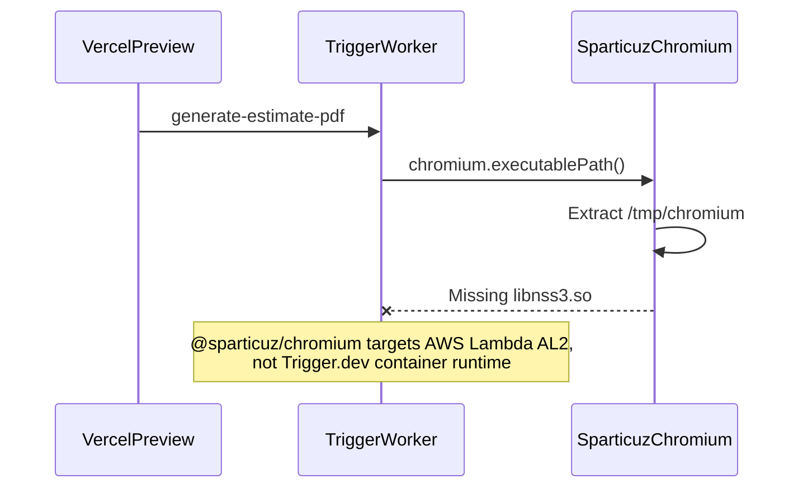

# Estimate PDF — Chromium launch failure on Trigger.dev worker

**Date:** 2026-06-10  
**Status:** Resolved  
**Affected:** `generate-estimate-pdf` on Esteo-Staging Trigger Production (Vercel Preview / `staging` branch)  
**Related:** [Estimate PDF export](../features/estimate-pdf-export.md), [Deployment](../architecture/deployment.md), [Trigger.dev + Vercel Preview](./2026-06-08-trigger-dev-vercel-preview.md)

PDF export/preview on Vercel Preview triggered `generate-estimate-pdf`, but the task failed when launching headless Chromium. After switching from `@sparticuz/chromium` (Lambda) to the official Trigger.dev `puppeteer()` build extension, PDF generation succeeded on worker version `20260610.8`.

---

## Symptom

On Vercel Preview (`staging` branch):

- User triggers PDF export or preview from estimate UI.
- UI shows generation in progress; task appears in Trigger.dev dashboard.
- Task **`generate-estimate-pdf`** fails after start (sometimes after retry).
- Error in Trigger run:

```text
Failed to launch the browser process: Code: 127
/tmp/chromium: error while loading shared libraries: libnss3.so: cannot open shared object file: No such file or directory
```

Earlier in the same rollout, runs could also sit in **Pending version** until tasks were deployed to Esteo-Staging.

---

## Timeline

| Step | What happened | Result |
| --- | --- | --- |
| 1 | PDF export code merged; Vercel Preview redeployed | App calls `tasks.trigger("generate-estimate-pdf")` |
| 2 | Trigger worker still on old version without new task | Runs stuck **Pending version** |
| 3 | Manual `npm run trigger:deploy` to Esteo-Staging | Task registered; runs start |
| 4 | Task runs but Chromium fails with `libnss3.so` | PDF stays FAILED / GENERATING |
| 5 | Replace `@sparticuz/chromium` with Trigger `puppeteer()` extension | Deploy `20260610.8`; Chrome installed in worker image |

---

## Root cause



| Layer | Cause |
| --- | --- |
| **Wrong Chromium stack** | [`render-estimate-pdf.ts`](../../src/pdf/server/render-estimate-pdf.ts) used `@sparticuz/chromium` in non-dev paths. Sparticuz bundles a minimal Lambda Chromium binary; Trigger.dev workers lack the expected NSS shared libraries → exit code 127. |
| **Missing build extension** | [`trigger.config.ts`](../../trigger.config.ts) had no `puppeteer()` extension — Chrome was never installed in the worker image. |
| **Deploy gap (earlier)** | New task id requires **`trigger:deploy`** to Esteo-Staging; Vercel redeploy alone does not update Trigger workers. |

---

## Solution applied

### 1. Trigger.dev Puppeteer build extension

[`trigger.config.ts`](../../trigger.config.ts):

```ts
import { puppeteer } from "@trigger.dev/build/extensions/puppeteer";

build: {
  external: ["uploadthing", "sharp", "puppeteer-core"],
  extensions: [
    prismaExtension({ schema: "prisma/schema.prisma", mode: "legacy" }),
    puppeteer(),
  ],
},
```

The extension (v4.4.6):

- Installs `google-chrome-stable` in the worker image at deploy time.
- Injects `PUPPETEER_EXECUTABLE_PATH=/usr/bin/google-chrome-stable` automatically (`deploy.env`, `override: true`).
- Does **not** run in `trigger:dev` — local dev needs `PUPPETEER_EXECUTABLE_PATH` in `.env.local`.

### 2. PDF renderer — no Sparticuz, no Trigger SDK coupling

[`src/pdf/server/render-estimate-pdf.ts`](../../src/pdf/server/render-estimate-pdf.ts):

- Removed `@sparticuz/chromium` and `NODE_ENV` branching.
- Validate `PUPPETEER_EXECUTABLE_PATH` before launch (clear error vs opaque “Failed to launch browser”).
- Launch with `executablePath: process.env.PUPPETEER_EXECUTABLE_PATH`.

Diagnostic log **`Launching PDF browser`** lives in [`generate-estimate-pdf.ts`](../../src/trigger/generate-estimate-pdf.ts) (task layer), not in the PDF module.

### 3. Dependencies

- Removed `@sparticuz/chromium` from `package.json`.
- Kept `puppeteer-core` only (no full `puppeteer` package).

### 4. Deploy

```powershell
$env:TRIGGER_PROJECT_ID="proj_lkorkbyjorynapnptmqa"
npm run trigger:deploy
```

Successful deploy: **version `20260610.8`**, 3 tasks detected.

---

## What was NOT the root cause

- **UploadThing / DATABASE_URL** — worker env was sufficient once the task actually ran.
- **Vercel Preview env** — PDF rendering happens on Trigger worker, not Vercel serverless.
- **Pending version** — separate issue (undeployed task); fixed by `trigger:deploy`, not by Chromium change.

---

## Lessons learned

| Lesson | Action |
| --- | --- |
| Sparticuz ≠ Trigger.dev | Use `@sparticuz/chromium` only on AWS Lambda/Vercel serverless with matching runtime. On Trigger.dev use `puppeteer()` extension. |
| New Trigger tasks need deploy | After adding/changing tasks, run `trigger:deploy` (or GitHub integration on `staging`). Vercel redeploy is not enough. |
| Do not hardcode Chrome path in code | Rely on extension-injected `PUPPETEER_EXECUTABLE_PATH`; avoid manual dashboard entry unless extension env is missing after redeploy. |
| Keep PDF module free of Trigger SDK | Logging/diagnostics in task file; renderer stays reusable for future preview/API routes. |
| Local `trigger:dev` | Set `PUPPETEER_EXECUTABLE_PATH` in `.env.local` (see `.env.example`). |

---

## Patterns to reuse (checklist)

When `generate-estimate-pdf` fails on Trigger.dev:

1. **Pending version** → redeploy tasks to Esteo-Staging (`TRIGGER_PROJECT_ID=proj_lkorkbyjorynapnptmqa npm run trigger:deploy`).
2. **`libnss3.so` / Code 127** → Sparticuz on wrong runtime; confirm `puppeteer()` in `trigger.config.ts` and no `@sparticuz/chromium` in code.
3. **Log `Launching PDF browser`** → expect `executablePath: "/usr/bin/google-chrome-stable"` on deployed worker.
4. **`PUPPETEER_EXECUTABLE_PATH is not configured`** → extension not applied, missing redeploy, or local dev without `.env.local`.
5. **Worker secrets** → `DATABASE_URL`, `UPLOADTHING_TOKEN` in Esteo-Staging → Production (see [deployment.md](../architecture/deployment.md)).

---

## Verification

1. Trigger Esteo-Staging → Production → Runs: `generate-estimate-pdf` **Completed**.
2. Log contains `Launching PDF browser` with non-empty `executablePath`.
3. No `libnss3.so` in stderr.
4. Estimate PDF status **READY**; preview/download works on Vercel Preview.

---

## Code references

| Area | Path |
| --- | --- |
| PDF render | [`src/pdf/server/render-estimate-pdf.ts`](../../src/pdf/server/render-estimate-pdf.ts) |
| Trigger task | [`src/trigger/generate-estimate-pdf.ts`](../../src/trigger/generate-estimate-pdf.ts) |
| Trigger config | [`trigger.config.ts`](../../trigger.config.ts) |
| Feature doc | [`docs/features/estimate-pdf-export.md`](../features/estimate-pdf-export.md) |
