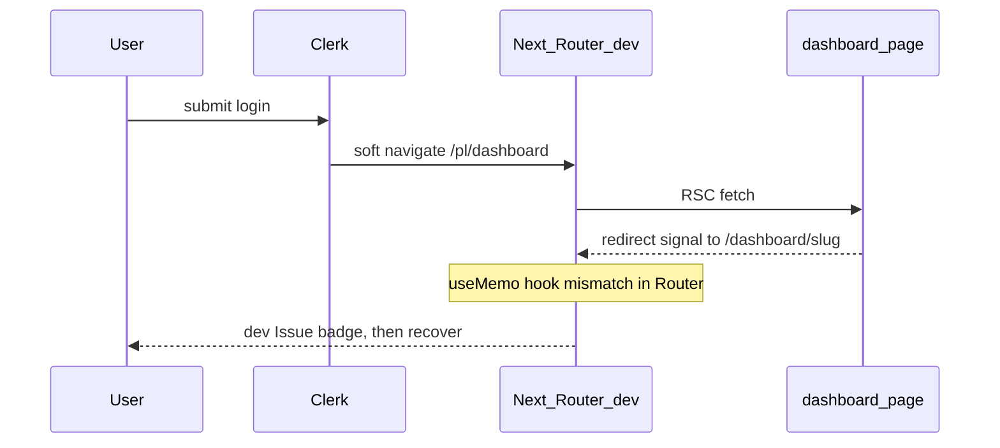

# Next.js dev overlay „Issue” after login (Router hooks)

**Date:** 2026-06-13  
**Status:** Accepted — dev-only, no production impact  
**Affected:** `npm run dev` post-login navigation (`/pl/sign-in` → `/pl/dashboard` → `/pl/dashboard/[slug]`)

## Symptom

After email/password sign-in in **local development**:

- Next.js dev overlay shows a brief **„Issue”** badge in the bottom corner
- The page reloads or navigates onward; the badge disappears within a moment
- Login **completes successfully** — user lands on `/pl/dashboard/[workspaceSlug]`
- Browser console (dev): `Uncaught Error: Rendered more hooks than during the previous render.`
- Stack trace points to **Next.js internal `Router`** (`app-router.js`), not application auth components:
  ```
  at Router (app-router.js)
  at updateMemo → useMemo
  ```

**Does not reproduce** in:

- Vercel Preview / staging
- Local production mode: `npm run build` + `npm run start` (empty console, all Network requests 200)
- Production deployments (no Next.js Dev Overlay)

## What was NOT the root cause

- **Clerk Elements / `sign-in-form.tsx`** — stack trace does not implicate our sign-in components; auth flow works end-to-end.
- **Broken login or redirect** — Network tab shows successful Clerk `sign_ins` → `tokens` → `dashboard` → workspace RSC fetches (all 200).
- **The 2026-06-01 „Rendering…” hang** — separate issue, already fixed with `cache(getAccessibleWorkspaces)`; this symptom is transient and self-recovers.
- **Corrupted `.next` cache** — clearing cache helps dev server stability but does not change the nature of this hooks warning.

## Root cause

**Known Next.js App Router dev behavior** when post-login navigation chains overlap:

1. Clerk soft-navigates to `/pl/dashboard` (sometimes twice — see [2026-06-01](./2026-06-01-blank-dashboard-rendering-after-login.md)).
2. [`dashboard/page.tsx`](../../src/app/[locale]/(dashboard)/dashboard/page.tsx) calls server `redirect()` to `/pl/dashboard/[slug]` for users with workspaces.
3. During the **client soft transition**, Next.js internal `Router` runs `useMemo` for `{ searchParams, pathname }` with a hook count that differs from the previous render → React throws in **development only**.
4. Dev overlay surfaces the error as „Issue”; navigation recovers on the next paint.

Upstream references: [next.js#63121](https://github.com/vercel/next.js/issues/63121), [next.js#78396](https://github.com/vercel/next.js/issues/78396).



## Resolution

**No code change.** Verified safe to ignore:

| Environment | Result |
| --- | --- |
| `npm run dev` | Transient „Issue” badge + console hooks error possible |
| `npm run build` + `npm run start` | Clean console, normal login |
| Vercel Preview / staging | Clean console, normal login |
| Production | No Dev Overlay; no user-visible impact |

## Do not

- Treat as a production bug or open a hotfix PR without reproducing on `npm run start` or Preview first.
- Add `HardRedirect` / `signInForceRedirectUrl` solely to silence dev overlay — unnecessary complexity for zero production benefit.
- Upgrade `@clerk/elements` or Next.js blindly hoping to fix dev Router hooks — verify against installed versions and retest sign-in OTP flow first.

## If it gets worse in dev

1. Confirm you are on `npm run dev`, not production — compare with `npm run build && npm run start`.
2. Clear stale dev state: stop all node processes on port 3000/3001, `Remove-Item -Recurse -Force .next`, restart `npm run dev`.
3. Capture stack trace with Console **Preserve log** — if the top frame is no longer `Router (app-router.js)`, investigate as a new issue.
4. Check [2026-06-01](./2026-06-01-blank-dashboard-rendering-after-login.md) if the symptom changes to perpetual **„Rendering…”** instead of a brief flash.

## Related

- [2026-06-01 blank dashboard after login](./2026-06-01-blank-dashboard-rendering-after-login.md) — Clerk double-navigate + RSC waterfall (fixed)
- [2026-06-06 sign-in /continue](./2026-06-06-sign-in-continue-blank.md) — Client Trust OTP (separate auth flow)
- [Authentication (Clerk Elements)](../features/authentication.md)
- [`.cursor/rules/debugging.mdc`](../../.cursor/rules/debugging.mdc) — test account, localhost debugging
